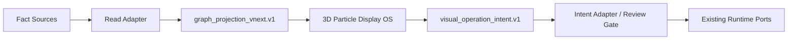

# 世界系统三维需求 OS 认知 Lens 方案

## 结论

其他线程提出的“认知流可视化”可以应用到当前世界系统三维需求 OS，但不能直接替换现有 3D 粒子构建逻辑。

适合真实落地的方式是：保留当前系统输入输出和端口边界，把新逻辑做成独立的显示投影层。它只消费投影数据，不改事实源；它只发出操作意图，不直接执行动作。

当前这个文件夹就是第一阶段：独立显示构建区。

## 当前系统中的稳定边界

已有系统里，3D 粒子云主要承担显示和交互，不应该成为事实源。

需要保留的边界：

- 当前 Electron 主窗口、Dock、状态对话、运行状态、MVP runtime 等模块不因为显示重构而改变。
- 真实人际图谱、事件图谱、运行状态和工具执行不由 3D 显示层直接读写。
- 3D 显示层未来接入时只读取 projection，不直接读取 `data/people/**`、`data/events/**`。
- 3D 显示层未来输出时只产生 `visual_operation_intent.v1`，由外部 adapter 决定是否执行。
- `frontend_display_contract.v1`、状态快照、现有 IPC 端口保持不变。

## 为什么不能直接替换成“神经网络图”

直接替换会有三个风险：

1. 语义风险：粒子颜色、大小、亮度如果直接绑定业务事实，可能让候选、预测、假设被误看成事实。
2. 接入风险：如果显示层直接读写 runtime/data，会破坏现有模块的输入输出边界。
3. 操作风险：如果点击 3D 节点直接触发动作，就绕过当前的审计、确认和 dry-run 机制。

因此，“认知流”应作为显示 Lens，而不是新的事实模型。

## 应用原则

采用以下原则落地：

- 粒子不是数据库节点，而是认知单元。
- 连接不是装饰线，而是关系、因果、冲突、依赖、反馈。
- 运动不是纯动画，而是当前思考、执行、等待反馈、预测扩散。
- 亮度表达激活度和当前相关性。
- 大小表达重要度、影响力、优先级。
- 颜色表达节点类型或 Lens 类型。
- 距离表达与当前目标的贡献关系。
- Z 轴在默认视图中表达认知层级，在 Memory Lens 中表达时间。

## 五种显示 Lens

### 1. System Lens

目的：让用户一眼看懂系统结构。

显示内容：

- 核心目标球。
- 世界系统模块。
- 输入端口。
- 输出端口。
- 禁止直接操作的边界。

视觉规则：

- 中央为当前系统核心。
- 第一圈为直接参与当前目标的模块。
- 第二圈为支撑模块。
- 第三圈为外围约束、平台、文档、审计。

真实接入时读取：

- `graph_projection_vnext.v1.domains`
- `graph_projection_vnext.v1.clusters`
- `graph_projection_vnext.v1.operation_affordances`

输出：

- 无直接业务输出。
- 点击节点只更新显示检查器。

### 2. Thinking Lens

目的：让用户看见系统当前如何思考。

显示内容：

- 当前目标。
- 推理路径。
- 被激活的相关节点。
- 节点之间的扩散顺序。

视觉规则：

- 当前目标最亮。
- 激活路径用流光表示。
- 扩散节点按激活时间依次闪烁。
- 非激活节点变暗或隐藏。

真实接入时读取：

- 当前目标摘要。
- 推理 trace。
- runtime overlay 中的 active node ids。

输出：

- `visual_operation_intent.v1`，例如 inspect、drill_down、compare。

### 3. Memory Lens

目的：让用户看见过去、现在、未来之间的关系。

显示内容：

- 历史事件。
- 当前状态。
- 未来计划。
- 证据引用。

视觉规则：

- Z 轴切换为时间轴。
- 过去在后层，当前在中心层，未来在前层。
- 证据连接用细线。
- 预测节点降低不透明度，避免和事实混淆。

真实接入时读取：

- projection 中的 source refs。
- 历史快照摘要。
- forecast branch 摘要。

输出：

- 只输出 inspect 或 compare 意图。

### 4. Decision Lens

目的：让用户看见方案、风险、权重和冲突。

显示内容：

- 候选方案。
- 风险节点。
- 冲突连接。
- 权重和 confidence。
- 等待确认的执行意图。

视觉规则：

- 方案越重要越靠近目标核心。
- 风险用红色边界和低频闪烁。
- 冲突连接用红色断续线。
- 高置信度节点更亮。

真实接入时读取：

- decision cluster projection。
- risk overlays。
- candidate/action intent 状态。

输出：

- `visual_operation_intent.v1`，但 execution mode 必须是 preview、dry_run 或 requires_confirmation。

### 5. Self Lens

目的：让用户看见系统自己的目标、约束、权限和当前能力状态。

显示内容：

- 当前目标。
- 当前约束。
- 可用能力。
- 禁止动作。
- 输入输出边界。
- 审计状态。

视觉规则：

- 约束节点环绕核心。
- 能力节点连接到可执行入口。
- 禁止动作使用锁定样式或低透明度。
- 所有外部动作必须显示确认边界。

真实接入时读取：

- status snapshot。
- operator note 摘要。
- available adapters 摘要。
- runtime policy。

输出：

- 只允许产生可审计的意图，不允许直接执行。

## 同屏界面方案

界面分为四个区域：

- 顶部：当前 projection、目标、模式、只读状态。
- 左侧：五种 Lens 开关。
- 中央：3D 粒子云舞台。
- 右侧：粒子检查器、连接说明、端口边界。

同屏开关规则：

- 五种 Lens 都在同一粒子云坐标系中叠加。
- 每个 Lens 有自己的颜色、节点角色和连接规则。
- 关闭 Lens 只隐藏对应显示层，不销毁 projection。
- 选中节点时，检查器显示该节点所属 Lens 和输入输出边界。

## 静态与动态的整合表达

真实显示时不应把五种 Lens 做成五个相互独立的图，而应采用一个全貌图：

- 静态底图：处理模块分类固定在同一空间坐标中，包括输入感知、记忆索引、推理规划、决策门、执行反馈、自我边界、输入输出端口。
- 动态覆盖：思维流、决策机制、风险冲突、时间演化、自我约束都沿静态模块流动。
- Lens 开关只控制覆盖层显隐，不改变底图坐标。
- 用户先看到系统区域，再看到粒子如何在区域之间流动，最后看到决策和约束如何影响流向。

推荐表达关系：

```text
Projection 输入
  -> 输入感知
  -> 记忆索引
  -> 推理规划
  -> 决策门
  -> 执行反馈
  -> Intent 输出

自我边界始终约束 决策门 与 执行反馈。
记忆 Lens 为时间证据层。
决策 Lens 为候选、冲突和风险层。
思维流 Lens 为动态激活路径。
```

这样一个全貌图中可以同时看到：

- 每个处理区域在哪里。
- 当前思维流经过了哪些区域。
- 哪些决策候选正在竞争。
- 哪些风险或策略边界阻断了执行。
- 哪些信息来自历史，哪些只是未来预测。

## 原系统模块投射

本实验区已只读查看当前系统代码，将 `ZhinengConsole.tsx` 中的 18 个 `WORLD_SYSTEM_NEBULAE` 星云模块投射到六个分类区域：

- 输入 / 感知区：`external-world`、`perception-fusion`、`event-extraction`
- 记忆 / 证据区：`global-events`、`world-state`、`world-model`、`learning-engine`、`feedback-memory`
- 推理 / 规划区：`social-cognition`、`relationship-policy`、`forecast-simulation`
- 决策 / 风险区：`decision-governance`、`safety-scope`
- 执行 / 反馈区：`capability-composition`、`action-layer`、`entity-work-nodes`
- 自我 / 边界区：`status-dialogue-system`、`visual-os`、`projection-contracts`

这个映射只用于显示层，不修改原系统。后续如果接入真实 projection，应由只读 adapter 输出这些模块节点及其 source refs。

## 三维交互要求

可旋转三维显示应满足：

- 模块、区域、连接都使用同一组三维坐标。
- Lens 开关不改变坐标，只改变图层显隐。
- 相机旋转不改变数据语义，只改变观察角度。
- 思维流和决策流沿原系统模块路径运动。
- 点击粒子只进入检查器，不触发 IPC、写入或外部动作。

## 数据流设计

推荐未来接入路线：



关键点：

- `Fact Sources` 不被显示层直接改写。
- `Read Adapter` 负责把真实系统状态变成投影。
- `3D Particle Display OS` 只显示 projection。
- 用户点击、拖拽、筛选只产生 intent。
- `Intent Adapter / Review Gate` 决定是否进入原系统端口。

## 与当前 3D 粒子构建逻辑的关系

当前系统已经有 3D 粒子窗口、Dock 入口、粒子云构建、边线、hover/click、独立显示投影等基础能力。

新的认知 Lens 不应直接重写这些入口，而应作为下一层抽象：

- 当前 `buildGraphPoints` 可以继续保留，作为 legacy/static topology 显示。
- 新增 projection builder 时，输出统一节点、边、overlay。
- 新增 Lens renderer 时，根据 Lens 配置决定显隐、颜色、激活、布局。
- 当前窗口入口可以未来新增一个 vnext route，但第一阶段不改现有入口。

## 分阶段落地

### Phase 0：独立方案与原型

当前文件夹完成：

- 独立文档。
- Lens 配置。
- 同屏开关原型。
- 不修改原系统。

### Phase 1：投影数据结构

在不接入真实数据的情况下，补充：

- `graph_projection_vnext.v1` 示例。
- `visual_operation_intent.v1` 示例。
- schema 草案。

### Phase 2：只读接入

接入当前系统时只读：

- 读取状态快照。
- 读取 process tree 或 topology projection。
- 读取 mock social/event projection。

不允许：

- 直接写 data。
- 直接触发 tool。
- 直接改 runtime state。

### Phase 3：意图回传

用户在 3D 中执行 inspect、compare、drill_down、simulate 时：

- 生成 `visual_operation_intent.v1`。
- 进入现有 review/dry-run/confirmation gate。
- 由原系统已有端口决定后续动作。

## 验收标准

第一阶段验收：

- 新文件夹存在。
- 原系统文件无改动。
- 五种 Lens 在同一界面中可开关显示。
- 文档说明清楚边界、接入方式和不影响范围。

后续接入验收：

- 显示层只读 projection。
- 所有用户操作都有 intent 记录。
- 候选、预测、事实在视觉上可区分。
- 关闭 3D 显示不影响原系统运行。
