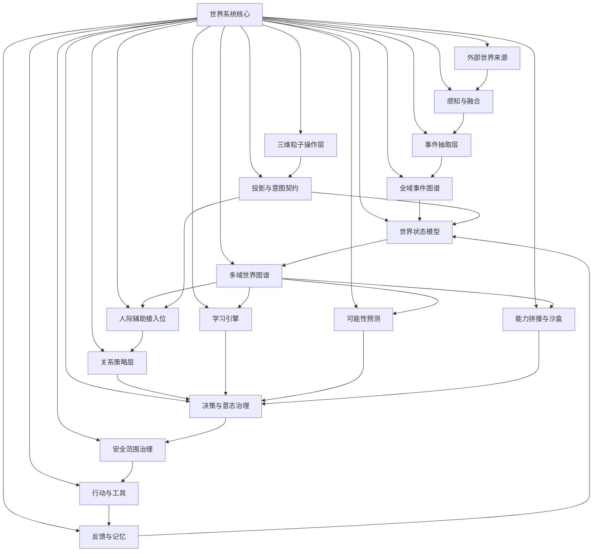

# 三维粒子星云拓扑与方案映射说明

状态：当前线程拓扑对齐文档，待用户确认，不是正式项目文档。

日期：2026-06-22

## 目的

本文件用于对齐三件事：

1. 当前已经扩展的 3D 粒子星云 UI。
2. `world-system-complete-theory.md` 中的完整世界系统理论方案。
3. `graph_projection_fixture.v1.json` 中的完整投影 fixture。

当前版本是拓扑完整态，不是实时业务接入态。它暂不接入真实人际关系系统、真实事件图谱、真实工具执行或真实外部平台。

## 当前规模

- 星云模块：18 个，另有 1 个世界系统核心。
- 内容星点：216 个。
- fixture projection nodes：235 个，包括 19 个 domain 节点和 216 个内容节点。
- fixture edges：260 条，包括语义流边和 domain -> content_star 包含边。

对应文件：

- UI 源码：`D:\zhineng\sightflow-desktop-agent-main\src\renderer\src\zhineng-console\ZhinengConsole.tsx`
- 完整理论：`D:\zhineng\thread-requirements\3d-point-cloud-graph-v2.2\world-system-complete-theory.md`
- 投影 fixture：`D:\zhineng\thread-requirements\3d-point-cloud-graph-v2.2\graph_projection_fixture.v1.json`
- 节点清单：`D:\zhineng\thread-requirements\3d-point-cloud-graph-v2.2\particle-nebula-node-inventory.md`

## 拓扑总图

## 方案层到星云模块映射

| 理论方案层 | 星云模块 | fixture domain | 当前覆盖状态 |
| --- | --- | --- | --- |
| 外部世界 | 外部世界来源 | `external-world` | 已覆盖语音、图像、屏幕、位置、文档、网络、设备、软件/API/插件 |
| 感知与来源接入 | 感知与融合 | `perception-fusion` | 已覆盖 Sensor Registry、Observation Atom、Fusion Bundle、五张矩阵、冲突、统一时空、潜变量、物理概念库 |
| 事件抽取 | 事件抽取层 | `event-extraction` | 已覆盖谁、何时、何地、做了什么、影响谁、证据、RawEvent、SemanticEvent、关系变化候选 |
| 全域事件图谱 | 全域事件图谱 | `global-events` | 已覆盖社会、物理、学习、实验、决策、行动、反馈事件、事件链、事件簇 |
| 世界状态模型 | 世界状态模型 | `world-state` | 已覆盖状态快照、状态差异、有效/观察/更新时间、置信度、状态范围和运行/风险/预测 overlay |
| 多域世界图谱 | 多域世界图谱 | `world-model` | 已覆盖人际、任务、知识、物体、自我状态、能力、预测、安全、反馈图谱 |
| 人际辅助系统接入 | 人际辅助接入位 | `social-cognition` | 已覆盖人物、关系、身份解析、社会事件关联、B2B 闭环、决策/触发/只读适配 |
| 关系策略层 | 关系策略层 | `relationship-policy` | 已覆盖 10 个策略桶、9 个处理目标、L0-L4、关系策略卡、四个关系智能体 |
| 学习引擎 | 学习引擎 | `learning-engine` | 已覆盖 7 个子模块、内化状态、失败条件 |
| 可能性预测 | 可能性预测 | `forecast-simulation` | 已覆盖 forecast_branch、全部核心评分、影响边、潜变量、观测缺口、干预候选、反事实模拟 |
| 外部能力理解与拼接 | 能力拼接与沙盒 | `capability-composition` | 已覆盖软件观察、能力原子、能力转需求、不设门槛枚举、代码切片、目标缺口、拼接计划、实现路径、沙盒验证、实现候选、tool-runtime 雏形 |
| 决策/意志/治理 | 决策与意志治理 | `decision-governance` | 已覆盖目标树、自我意志接口、策略分配、资源评估、风险审查、可解释推荐、message_draft、人工确认 |
| 安全范围治理 | 安全范围治理 | `safety-scope` | 已覆盖 Safety Scope Profile、sandbox_self_containment.v1、Safety Scope Revision、Terminal Safety Review、四级风险、失败恢复 |
| 行动层 | 行动与工具 | `action-layer` | 已覆盖沟通、提醒、项目执行、实验设计、设备控制、文档生成、工具调用、平台预览、手工清单 |
| 反馈层 | 反馈与记忆 | `feedback-memory` | 已覆盖结果、偏差、策略、知识、意志权重、五类记忆、压缩/归档、检索理由 |
| 三维粒子 OS | 三维粒子操作层 | `visual-os` | 已覆盖六层空间下钻和 observe/inspect/drill_down/compare/simulate/compose/handoff/review |
| 投影/意图接口 | 投影与意图契约 | `projection-contracts` | 已覆盖 projection fields、runtime overlays、operation affordances、source_refs、warnings、intent refs、execution_mode |

## 位置罗盘规则

未来新增任何内容时，先按以下规则找到位置：

| 新增内容类型 | 归入位置 | 负责 owner | 负责闸口 |
| --- | --- | --- | --- |
| 新输入来源、采集 lane、外部文件来源 | `external_world.*` | `Intake and Sensor Layer` | `source_intake_gate` |
| 原始观测、传感器矩阵、融合冲突、时空校准 | `perception.*` | `Perception Fusion Layer` | `observation_fusion_gate` |
| 事件字段、事件候选、关系变化候选 | `event_extraction.*` | `Event Extraction Layer` | `event_candidate_gate` |
| 新事件类型、事件链、事件簇 | `global_events.*` | `Global Event Graph` | `global_event_graph_gate` |
| 状态、时间、状态差异、运行态 overlay | `world_state.*` | `World State Runtime` | `state_update_gate` |
| 新图谱域或事实组织方式 | `world_model.*` | `World Model Layer` | `world_model_projection_gate` |
| 人物、关系、身份解析、人际闭环接入 | `social.*` | `Social Cognition Module` | `social_read_only_adapter_gate` |
| 关系策略、关系目标、权限、策略卡、关系智能体 | `relationship_policy.*` | `Relationship Policy Layer` | `relationship_policy_gate` |
| 知识、类比、因果、虚拟训练、内化规则 | `learning.*` | `Learning Engine` | `learning_internalization_gate` |
| 变量、影响边、预测评分、未来分支、反事实 | `forecast.*` | `Possibility Forecast Graph` | `forecast_only_gate` |
| 外部软件、代码切片、能力拼接、沙盒验证 | `capability.*` | `Capability Composition and Sandbox Realization Layer` | `sandbox_self_containment_gate` |
| 目标树、策略分配、资源、意志接口、推荐选项 | `decision.*` | `Decision and Will Governance Layer` | `decision_governance_gate` |
| 安全范围、安全修订、末端审查、阻断、失败恢复 | `safety.*` | `Self-Awareness Governance Layer` | `safety_scope_revision_gate` |
| 沟通、提醒、项目执行、实验、设备、文档、工具 | `action.*` | `Action and Tool Layer` | `action_execution_gate` |
| 结果、偏差、策略修正、知识更新、记忆生命周期 | `feedback.*` | `Feedback and Memory Layer` | `feedback_writeback_gate` |
| 视觉层级、交互模式、下钻、比较、模拟、handoff | `visual_os.*` | `Visual World Operating Layer` | `visual_operation_gate` |
| 投影字段、source_refs、operation affordances、intent | `projection_contract.*` | `Projection and Intent Contract` | `contract_schema_gate` |
| 跨域全局原则、候选/事实分离、审计引用 | `core.*` | `World System Architecture` | `core_alignment_gate` |

## 权属和闸口原则

- 每个内容星点必须有 `owner` 和 `gate`。如果星点没有单独 owner/gate，则继承所属星云的 owner/gate。
- 每个内容星点必须有 `compass`。如果星点没有单独 compass，则使用 `{compass_prefix}.{star_id}`。
- 跨域内容允许多处投影，但底层事实源只能有一个主归属。
- 候选、预测、沙盒结果不能显示成已确认事实。
- 进入真实人际辅助系统前，必须先从 `mock` 或 `fixture` 升级到 `read_only_adapter`，再进入 `existing_module_handoff`。
- 真实行动、真实发送、设备控制、外部平台调用必须继续经过对应行动闸口和末端安全审查。

## 可扩展内容说明

当前 fixture 已覆盖主方案的拓扑位置，但未来仍可继续细化：

- 将每个策略桶拆成独立策略规则、指标和样例。
- 将每张传感器矩阵拆成属性/实体/事件/互补/写入的行列结构。
- 将每种事件类型拆成 schema、证据规则、写入规则和提升门禁。
- 将可能性预测评分拆成公式、权重、反馈校准和样例。
- 将能力拼接拆成真实代码分析、接口能力、组合计划和验证结果。
- 将安全范围拆成 profile 版本、修订记录、适用阶段和提升条件。
- 将 `visual_operation_intent.v1` 拆成真实 intent schema、审计记录和 adapter 行为。
- 将当前 fixture 接入真实 `social_assistant_projection_adapter`，但该动作需要用户另行确认。

## 当前边界

- 当前 fixture 不读取 `data/people/**`。
- 当前 fixture 不读取 `data/events/**`。
- 当前 fixture 不读取真实 runtime 状态。
- 当前 fixture 不触发外部平台、设备控制或真实发送。
- 当前网页只是完整拓扑和视觉操作面的独立检查入口。

## 2026-06-22 状态对话系统补充

新增星云模块：`status-dialogue-system`，中文定位为“系统主体状态对话系统”。

拓扑位置：
- 上游：`world-state` 提供全局状态和运行叠加态，`projection-contracts` 提供投影字段、来源和操作边界，`visual-os` 提供当前焦点和交互层级。
- 下游：当前只输出状态解释、焦点摘要、闸口说明和只读问答；未来可接入模型、语音识别、工具只读检查和意识层风格，但仍不得绕过行动层与末端安全审查。
- 罗盘：`status_dialogue.*`
- owner：`Subject Status Dialogue Runtime`
- gate：`status_dialogue_read_only_gate`

当前已映射内容星点：
- `global_state_scan`
- `subsystem_status_index`
- `module_health_probe`
- `model_adapter`
- `small_model_ipc_adapter`
- `first_person_prompt_contract`
- `input_port.user_query`
- `input_port.focus_context`
- `output_port.first_person_reply`
- `output_port.voice_line`
- `output_port.attention_log`
- `constraint.no_narrator`
- `constraint.minimal_voice`
- `constraint.no_hidden_cot`
- `fallback.local_status`
- `awareness_layer_bridge`
- `self_awareness_style`
- `first_person_voice`
- `third_person_voice`
- `text_input`
- `text_output`
- `speech_synthesis`
- `voice_dialogue`
- `conversation_memory`
- `retrieval_router`
- `tool_function_calling`
- `multimodal_dialogue_slot`
- `efficiency_first_cache`
- `state_only_boundary`

边界确认：当前实现为本窗口内的状态检查和语音合成输出，不接入真实模型 API，不读取真实人际关系图谱，不触发真实工具调用，不替代现有系统的执行链路。
