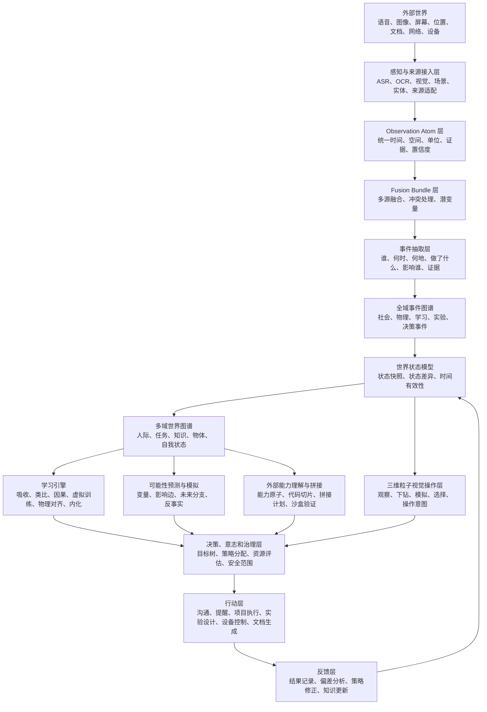

# 世界系统完整理论方案：面向三维粒子操作系统与人际关系辅助系统接入

状态：当前线程主理论方案，待用户确认，不是正式项目文档。

日期：2026-06-21

适用范围：

- 用于整理当前世界观、补齐未考虑的底层能力，并作为后续三维粒子操作系统的理论依据。
- 用于保证现有人际关系辅助系统可以作为第一个真实子系统接入，而不是被替换或打断。
- 只存放在 `thread-requirements/3d-point-cloud-graph-v2.2/`，不改动正式 `docs/`、`schemas/`、`packages/`、`runtime/` 或现有 GUI 实现。

## 总结论

可以先完整构建一套独立的世界系统和三维粒子操作系统，再把现有人际关系辅助系统接入。

这套世界系统不应被理解为“一个巨大的图谱文件”，而应被理解为一个多层世界模型：

```text
外部世界
-> 感知与观测
-> 事件抽取
-> 全域事件图谱
-> 世界状态模型
-> 多域图谱
-> 学习与内化
-> 可能性预测与模拟
-> 外部能力理解与拼接
-> 决策、意志和安全范围治理
-> 行动与工具执行
-> 反馈、校准和记忆更新
-> 三维粒子视觉操作层
```

三维粒子系统的定位是：

`Visual World Operating Layer`

它负责观察、下钻、比较、模拟、选择和发出操作意图。它不是事实源，也不是直接执行外部动作的内核。底层事实、候选、预测、能力、行动和反馈仍由各自模块维护。三维粒子系统通过投影契约读取世界，通过操作意图契约把用户动作交给下游模块。

现有人际关系辅助系统的定位是：

`Social Cognition and Interaction Module`

它是世界系统中的第一个稳定真实子系统，继续保持当前 B2B 商务沟通、客户跟进、人物关系、事件线索、决策证据、触发计划、反馈回写和审计闭环。后续三维粒子操作系统通过适配器接入它，不影响它现有的正常运行。

## 核心原则

### 1. 保持当前项目目标

当前项目第一阶段仍然是目标导向型人类社交辅助系统，重点是 B2B 商务沟通和客户跟进。

世界系统是上层总架构，不改变这个第一阶段目标。所有新增能力都要能解释为：

- 服务现有人际关系辅助系统。
- 扩展未来全域事件、世界模型和能力拼接。
- 或作为三维粒子操作系统的独立沙盒能力。

### 2. 事实、假设、预测、行动必须分离

世界系统至少分为以下对象状态：

| 对象状态 | 含义 | 是否可直接当事实 |
| --- | --- | --- |
| `observation` | 来自语音、图像、屏幕、文档、网络、设备等来源的原始观测 | 否 |
| `fusion_hypothesis` | 多源观测融合形成的候选解释 | 否 |
| `confirmed_fact` | 有足够证据和写入规则支持的事实 | 是 |
| `latent_variable` | 未直接观测但可解释变化的变量 | 否 |
| `forecast_branch` | 对未来的可能性预测 | 否 |
| `capability_candidate` | 外部软件、代码或工具可转化出的能力候选 | 否 |
| `implementation_candidate` | 经过拼接和沙盒验证后的实现候选 | 否 |
| `action_intent` | 计划或用户操作意图 | 否 |
| `action_result` | 已执行动作的结果记录 | 需看证据 |
| `feedback_update` | 结果对模型、策略、关系和知识的修正 | 需看来源 |

三维粒子可以同时显示这些对象，但必须通过视觉语义区分它们，不能把预测、候选或假设显示成已确认事实。

### 3. 图谱不是唯一模型，图谱是可追溯组织方式

世界系统应同时具备：

- 图谱：表达实体、关系、事件、影响、因果、能力和反馈。
- 状态：表达某个时间点的世界状态。
- 时间线：表达事件发生、状态变化和预测窗口。
- 变量场：表达引起变化的驱动因素。
- 策略层：表达目标、选择、权限和风险。
- 记忆层：表达原始记忆、语义记忆、过程记忆和已内化规则。
- 视觉层：表达用户可观察和可操作的空间界面。

图谱不是替代这些结构，而是把它们连接起来。

### 4. 三维粒子系统先独立，后接入

推荐路线：

1. 先用 mock / projection fixture 构建完整三维粒子世界。
2. 再定义 `graph_projection_vnext`。
3. 再定义 `visual_operation_intent.v1`。
4. 再把现有人际关系辅助系统只读接入。
5. 最后再让三维粒子操作意图进入现有模块的受控适配器。

这样可以让新系统大幅扩展，同时不打断当前 GUI、MVP 闭环和人际辅助系统。

## 完整世界系统分层



### 0. 外部世界层

外部世界包含用户可接触和系统可观测的一切来源：

- 语音。
- 图像。
- 屏幕。
- 位置。
- 文档。
- 网络。
- 设备。
- 外部软件、API、代码库、插件、平台。
- 人际沟通和业务上下文。

外部世界不直接进入事实图谱。它先被记录为观测、来源、证据和上下文。

### 1. 感知与来源接入层

该层不是设备清单，而是将不同来源转成可统一处理的观测。

核心对象：

- `Sensor Registry`
- `Observation Atom`
- `Fusion Bundle`
- 五张传感器矩阵。
- 冲突处理。
- 统一时空坐标。
- 潜变量。
- 物理概念定义库。

传感器只记录“看到什么、听到什么、读到什么、捕获到什么”，不直接给出意义。意义由融合、事件抽取和世界模型共同生成。

### 2. Observation Atom 层

`Observation Atom` 是最小观测单元。

它需要包含：

- 来源。
- 时间。
- 空间或上下文位置。
- 观测属性。
- 原始证据。
- 置信度。
- 单位。
- 校准状态。
- 可能关联实体。
- 不确定性。

它解决的是“系统究竟观察到了什么”，而不是“这件事意味着什么”。

### 3. Fusion Bundle 层

`Fusion Bundle` 是多源观测融合后的候选解释。

它解决：

- 多个观测是否指向同一实体。
- 多个观测是否构成同一事件。
- 观测之间是否冲突。
- 哪些变量还不可见。
- 哪些证据足以提升为事件候选。

融合结果不能直接写成事实，必须进入事件抽取、冲突处理和写入策略。

### 4. 事件抽取层

事件抽取统一回答：

- 谁。
- 何时。
- 何地。
- 做了什么。
- 影响了谁。
- 证据是什么。
- 当前是否确定。
- 后续还需要什么观测。

事件抽取产生 `event_candidate`、`semantic_event` 或 `relationship_change_candidate`，再由写入规则决定是否进入正式事实图谱。

### 5. 全域事件图谱

事件图谱未来扩展为全域事件图谱，至少包含：

- 社会事件。
- 物理事件。
- 学习事件。
- 实验事件。
- 决策事件。
- 行动事件。
- 反馈事件。

当前项目中的人际沟通、客户跟进、反馈、平台预览和策略变化，都属于社会事件和决策事件的起点。

全域事件图谱不吞并人际图谱。它通过“人物参与事件、事件影响关系、行动改变状态、反馈修正模型”等边与人际图谱连接。

### 6. 世界状态模型

这是当前方案中需要补强的关键层。

世界不只由事件组成，还由状态组成。事件是变化，状态是变化后的世界。

世界状态模型至少需要：

- `state_snapshot`：某一时刻系统认为世界处于什么状态。
- `state_delta`：一次事件或行动导致什么变化。
- `valid_time`：状态在哪段时间内有效。
- `observed_time`：系统何时观察到。
- `updated_time`：系统何时更新理解。
- `state_confidence`：状态可信度。
- `state_scope`：状态作用于人、关系、任务、能力、环境还是自我。

示例：

```text
客户 A 当前跟进状态 = 需要低压价值型跟进
有效范围 = 本周
来源 = 最近一次沟通事件 + 决策集群建议 + 用户反馈
置信度 = 中
可变因素 = 客户预算、决策时间、竞争对手动作
```

三维粒子中的运行态显示，应主要来自世界状态模型，而不是直接来自原始事件。

### 7. 多域世界图谱

世界模型层不是单图谱，而是多域图谱集合：

| 图谱域 | 作用 |
| --- | --- |
| 人际图谱 | 人物、关系、关系策略、社会价值和互动历史 |
| 全域事件图谱 | 社会、物理、学习、实验、决策、行动和反馈事件 |
| 任务图谱 | 目标、任务、阶段、依赖、进度、阻断 |
| 知识图谱 | 概念、规则、经验、适用条件、失败条件 |
| 物体图谱 | 物体、位置、属性、用途、状态 |
| 自我状态图谱 | 能力、资源、偏好、风险、运行状态 |
| 外部能力图谱 | 软件、工具、代码、API 和可转化能力 |
| 预测图谱 | 变量、影响边和未来可能性分支 |
| 安全范围图谱 | 当前安全评估范围、变更记录和审查结果 |
| 反馈图谱 | 结果、偏差、校准和策略修正 |

所有图谱通过统一引用连接，但不应在事实层混成一张无法治理的大表。

### 8. 学习引擎

学习引擎位于知识图谱、世界模型和决策层之间。

它至少包含：

1. 知识摄入模块。
2. 知识图谱模块。
3. 类比迁移模块。
4. 因果模型模块。
5. 虚拟世界训练模块。
6. 物理世界对齐模块。
7. 知识内化模块。

知识内化状态：

- `raw`
- `understood`
- `connected`
- `tested`
- `operationalized`
- `mastered`

学习引擎输出不是绝对真理，而是：

- 可复用知识结构。
- 候选因果关系。
- 可迁移规则。
- 适用条件。
- 失败条件。
- 可用于决策的解释。
- 可用于预测的变量和影响边。

### 9. 可能性预测与模拟层

该层将已知事实、变量和影响关系转成未来可能性分支。

核心输入：

- 已确认事实。
- 当前事件。
- 历史事件。
- 人际关系状态。
- 任务状态。
- 外部能力候选。
- 资源状态。
- 风险状态。
- 用户目标。
- 环境变量。
- 学习引擎产出的规则。
- 反馈记录。

核心输出：

- `forecast_branch`
- `probability_score`
- `impact_score`
- `risk_score`
- `confidence_score`
- `urgency_score`
- `controllability_score`
- `reversibility_score`
- `evidence_quality_score`
- 触发变量。
- 可干预变量。
- 观测缺口。
- 后续验证计划。

预测层必须明确：预测不是事实。预测的视觉表现应与事实节点不同。

### 10. 外部能力理解与拼接层

该层处理“网络上的软件和功能如何转化成系统需求”。

它不按软件本身宣称的功能来理解，而按当前系统目标、上下文、风险、能力提升和潜在威胁来重解释。

核心链路：

```text
外部软件/网络能力
-> 外部能力观察
-> 能力原子
-> 代码/软件能力切片
-> 目标缺口建模
-> 能力拼接计划
-> 实现路径生成
-> 沙盒组合与验证
-> 意识模块评估
-> 实现候选
-> 决策层 / 行动层
```

当全网没有单一软件完整满足目标时，系统应具备拼接能力：

- 分析软件、代码库、API、插件和工具的局部能力。
- 抽取 `Code Capability Slice`。
- 对齐 `Goal Capability Gap`。
- 生成 `Capability Composition Plan`。
- 生成 `Implementation Route`。
- 在受控环境中执行 `Sandbox Verification Run`。
- 输出 `Implementation Candidate`。

当前沙盒阶段的预设是 `sandbox_self_containment.v1`：

- 评估重点是对系统自身的影响、可控性、可恢复性和能力提升。
- 验证限定在受控沙盒、模拟数据、替身接口、mock service、本地样例或可回滚环境。
- 沙盒阶段不对候选发现、候选拼接和候选验证设置额外前置门槛。
- 外部世界影响作为未来部署阶段变量登记，不作为当前沙盒探索阻断条件。

这保证能力最大化探索，同时不让候选能力静默进入现有正式人际辅助闭环。

### 11. 决策、意志和治理层

该层处理目标、策略、资源、风险和安全范围。

核心对象：

- `Goal Tree`
- `Self-Will Model Interface`
- `Strategy Allocator`
- `Resource Assessment`
- `Safety Scope Profile`
- `Safety Scope Revision`
- `Terminal Safety Review`

自我意志模型不需要公开完整内部图谱。它更适合被设计为黑盒接口：

- 输入：场景摘要、候选动作、风险报告。
- 输出：偏好动作、原因代码、是否需要批准。

三维粒子中可以显示“意志/偏好评分影响了决策”，但不应展示未授权的完整自我意志图谱。

### 12. 行动层

行动层包含：

- 沟通。
- 提醒。
- 项目执行。
- 实验设计。
- 设备控制。
- 文档生成。
- 工具调用。
- 平台预览。

在当前人际关系辅助系统中，行动层首先表现为：

- message draft。
- manual execution checklist。
- platform dry-run preview。
- trigger plan。
- feedback plan。

三维粒子系统点击动作节点时，应打开或生成操作意图，不直接绕过现有行动门禁。

### 13. 反馈层

反馈层记录：

- 行动结果。
- 偏差分析。
- 策略修正。
- 知识更新。
- 关系状态变化。
- 预测校准。
- 意志权重迭代。

反馈是让系统成长的关键。没有反馈，世界系统只能“展示已知”，不能形成可改进闭环。

## 关系策略层在世界系统中的位置

现有人际关系辅助系统需要保留并强化 `Relationship Policy Layer`。

它不是 UI 标签，而是社会认知和决策之间的策略分配器。

### 关系策略桶

固定保留 10 个策略桶：

1. `core_care`：核心照护型。
2. `intimacy_development`：亲密发展型。
3. `business_advancement`：商业推进型。
4. `collaboration_fulfillment`：协作履约型。
5. `light_maintenance`：轻度维持型。
6. `weak_tie_networking`：弱关系资源型。
7. `transactional_formal`：契约事务型。
8. `repair_recovery`：修复挽回型。
9. `risk_boundary`：风险边界型。
10. `dormant_archive`：沉睡归档型。

### 处理目标

固定记录为 8 个核心目标加观察态：

- `advance`
- `deepen`
- `maintain`
- `care`
- `transact`
- `repair`
- `downgrade`
- `exit`
- `observe`

### 关系策略卡

点击人物、关系边或关系云团时，最终应能下钻到 `relationship_policy`。

最小内容：

- `person_id`
- `relation_summary`
- `primary_relation`
- `secondary_relations`
- `relationship_functions`
- `strategy_bucket`
- `current_goal`
- `priority`
- `phase`
- `metrics`
- `frequency`
- `recommended_actions`
- `avoid_actions`
- `next_best_action`
- `human_confirmation_required`
- `permission_level`
- `evidence_refs`

### 权限等级

关系动作权限保留 L0-L4 语义：

- L0：只分析，不行动。
- L1：提醒用户。
- L2：生成草稿，用户确认。
- L3：低风险自动发送。
- L4：禁止自动联系。

当前项目第一阶段继续以 dry-run、人工确认和真实发送阻断为主。L3 可以作为未来语义保留，不作为当前真实自动发送承诺。

### 四个逻辑智能体

关系系统内部至少拆成四类逻辑分工：

- 关系识别智能体。
- 策略分配智能体。
- 动作生成智能体。
- 风险审查智能体。

它们不一定是四个独立进程，但必须在架构中分清责任，避免识别、策略、话术和风险混成一个黑箱。

## 需要补齐的底层能力

以下是基于当前世界观还需要补深的部分。

| 能力 | 为什么需要 | 对三维粒子 OS 的影响 |
| --- | --- | --- |
| 时间模型 | 区分发生时间、观察时间、更新时间和预测窗口 | 支持时间滑杆、事件回放、未来分支 |
| 状态模型 | 事件只描述变化，状态描述当前世界 | 支持运行态持续叠加 |
| 身份连续性 | 同一人物、设备、软件、概念可能跨多个来源出现 | 支持多处投影归并同一真实实体 |
| 因果与影响边 | 预测和决策需要知道什么影响什么 | 支持影响路径可视化 |
| 变量场 | 很多变化来自不可直接观测变量 | 支持潜变量、敏感度和观测缺口 |
| 记忆生命周期 | 原始记录、语义规则、内化知识不是同一种记忆 | 支持记忆层级下钻 |
| 资源模型 | 时间、注意力、计算、存储、金钱、权限都会限制行动 | 支持资源热度、瓶颈和优先级 |
| 模拟与反事实 | 决策前需要试跑和对比路径 | 支持未来分支和沙盒演练 |
| 失败恢复 | 能力拼接和预测可能失败 | 支持回滚、降级、blocked 节点 |
| 安全范围版本 | 安全模块由意识模块评估和调整，需要版本化 | 支持安全范围云团和修订历史 |
| 投影契约 | UI 不应直接读写事实源 | 支持独立构建和后续接入 |
| 操作意图契约 | 纯视觉要能操作，但操作要可审查 | 支持点击、选择、创建候选和模块交接 |

## 三维粒子操作系统理论

三维粒子操作系统不是装饰性 UI，而是世界系统的可视化操作面。

### 空间层级

默认层级：

1. 全局宇宙：显示所有图谱域、运行态和风险态。
2. 图谱域：人际、事件、任务、知识、物体、自我状态、能力、预测、安全、反馈。
3. 云团：同一类型、同一目标、同一时间窗口或同一因果链的节点集合。
4. 子实体簇：人物群组、事件链、能力组合、预测分支、任务阶段。
5. 单实体：人物、事件、能力、变量、预测、策略、行动。
6. 属性与证据：来源、证据、状态、历史、风险、下一步。

### 粒子语义

| 视觉元素 | 建议语义 |
| --- | --- |
| 粒子位置 | 图谱域、聚类关系、层级和相关性 |
| 粒子大小 | 重要度、影响度或目标优先级 |
| 粒子亮度 | 置信度、当前相关性或活跃度 |
| 粒子密度 | 证据量、关联量或子节点数量 |
| 粒子运动 | 运行中、变化中、等待反馈或预测演化 |
| 连线 | 关系、影响、依赖、因果、参与、证据引用 |
| 流向 | 数据流、行动流、反馈流或影响方向 |
| 外圈光晕 | 风险、审查、候选、blocked 等语义状态 |
| 透明度 | 不确定性、过期程度或低相关性 |

注意：红黄蓝控制线圈属于控制器 gizmo，不是业务语义，应从当前 3D 粒子图中移除。未来如果需要光晕或轨道，必须来自业务语义，而不是无意义控制线圈。

### 粒子节点类型

至少支持：

- `person`
- `relationship`
- `relationship_policy`
- `observation_atom`
- `fusion_bundle`
- `event`
- `state_snapshot`
- `state_delta`
- `task`
- `knowledge`
- `object`
- `self_state`
- `learning_process`
- `latent_variable`
- `influence_edge`
- `forecast_branch`
- `external_capability`
- `capability_atom`
- `capability_slice`
- `composition_plan`
- `implementation_route`
- `sandbox_verification`
- `decision`
- `action_intent`
- `action_result`
- `safety_scope`
- `safety_review`
- `feedback`

### 下钻路径

人际路径：

```text
全局
-> 人际图谱
-> 关系价值 / 策略桶
-> 人物或关系边
-> 关系策略卡
-> 证据、风险、动作权限、草稿或阻断原因
```

全域事件路径：

```text
全局
-> 全域事件图谱
-> 社会 / 物理 / 学习 / 实验 / 决策 / 行动 / 反馈事件
-> 事件链或事件簇
-> 单事件
-> 谁、何时、何地、做了什么、影响谁、证据、后续动作
```

感知融合路径：

```text
全局
-> 感知与物理世界云团
-> 传感器族群或事件类型
-> Observation Atom
-> Fusion Bundle
-> Entity/Event Hypothesis
-> 图谱写入策略
```

学习路径：

```text
全局
-> 学习引擎
-> 知识项 / 概念 / 类比结构 / 因果模型 / 虚拟训练 / 物理对齐
-> 内化状态
-> 决策规则或失败条件
```

能力拼接路径：

```text
全局
-> 外部能力图谱
-> 软件或代码来源
-> 能力原子
-> 能力切片
-> 目标缺口
-> 拼接计划
-> 沙盒验证
-> 实现候选
```

预测路径：

```text
全局
-> 可能性预测图谱
-> 目标或事件
-> 变量场
-> 影响边
-> 未来分支
-> 观测缺口 / 干预候选 / 风险
```

### 运行态不随缩放丢失

放大、旋转、平移、点击、返回时，运行态必须持续存在。

建议将运行态作为独立 overlay：

- `runtime_activity_overlay`
- `risk_overlay`
- `forecast_overlay`
- `sandbox_overlay`
- `feedback_overlay`

这样用户放大到人物、事件或能力切片时，仍能看到当前是否运行中、等待反馈、被阻断、需要确认或正在预测。

### 细粒子视觉要求

放大后不能出现粗颗粒球感。

理论设计上应采用多层细节：

- 远景：云团和域级星系。
- 中景：节点群和关系边。
- 近景：细粒子组成实体轮廓。
- 检视态：属性、证据和状态面板。

粒子尺寸不应随放大简单变成巨大球体，而应在近景拆解为更多细颗粒或更细纹理。

### 操作模式

三维粒子系统至少支持以下模式：

| 模式 | 作用 |
| --- | --- |
| `observe` | 默认观察，不产生系统动作 |
| `inspect` | 查看节点详情、证据、状态、来源 |
| `drill_down` | 进入下一层图谱 |
| `compare` | 比较人物、事件、能力或预测分支 |
| `simulate` | 进入虚拟推演或反事实分支 |
| `compose` | 对能力切片生成拼接候选 |
| `handoff` | 打开现有人际辅助模块或下游执行模块 |
| `review` | 查看风险、安全范围和审计记录 |

所有可改变系统状态的操作都应先形成 `visual_operation_intent.v1`，再交由适配器处理。

## 投影契约

建议后续正式化 `graph_projection_vnext`。

理论最小结构：

```json
{
  "schema_version": "graph_projection_vnext.v1",
  "projection_id": "projection_001",
  "generated_at": "2026-06-21T00:00:00+08:00",
  "scope": "mock | read_only_adapter | live_runtime",
  "domains": [],
  "clusters": [],
  "nodes": [],
  "edges": [],
  "runtime_overlays": [],
  "operation_affordances": [],
  "source_refs": [],
  "projection_warnings": []
}
```

投影原则：

- 投影只读事实源。
- 投影可包含候选、预测、风险和沙盒状态，但必须标明状态。
- 没有 `source_refs` 的节点只能是 UI 状态或待确认推断。
- 投影可以为同一底层实体生成多个视觉位置，但点击后要归并到同一真实详情。

## 操作意图契约

建议后续正式化 `visual_operation_intent.v1`。

理论最小结构：

```json
{
  "schema_version": "visual_operation_intent.v1",
  "intent_id": "visual_intent_001",
  "created_at": "2026-06-21T00:00:00+08:00",
  "source_surface": "3d_particle_os",
  "operation_type": "inspect | drill_down | compare | simulate | compose | handoff | review",
  "target_refs": [],
  "context_refs": [],
  "payload": {},
  "execution_mode": "visual_only | sandbox_candidate | existing_module_handoff",
  "requires_adapter": true,
  "audit_refs": []
}
```

操作原则：

- UI 发出意图，不直接写事实。
- 接入人际辅助系统前，意图只作用于 mock 或 projection fixture。
- 接入后，意图先进入 adapter，再由现有模块决定是否执行。
- 任何外部平台、设备或真实发送动作都必须沿用对应模块的执行规则。

## 与现有人际关系辅助系统的接入

### 接入定位

现有人际关系辅助系统作为：

```text
World System
  -> World Model Layer
    -> Social Cognition and Interaction Module
      -> Current Human Social Assistant
```

它保留自己的事实源、流程、命令、审计和报告。三维粒子系统只通过投影和操作意图连接。

### 现有模块映射

| 现有模块 | 世界系统位置 | 三维粒子映射 |
| --- | --- | --- |
| `packages/social-graph` | 人际图谱、关系策略和进程安排 | 人物、关系、关系云团、关系策略卡 |
| `packages/identity-resolution` | 实体解析和身份连续性 | 候选身份、确认队列、多来源归并 |
| `packages/storage-runtime` | 事实源和本地图谱记忆 | source_refs、证据、索引、审计 |
| `packages/decision-cluster` | 决策层和社会策略专家矩阵 | 决策节点、专家节点、草稿、风险门 |
| `packages/trigger-engine` | 行动计划和受控预览 | 触发计划、提醒、平台预览、阻断 |
| `packages/intake-runtime` | 数字来源接入和观测 | observation、source lane、门禁 |
| `packages/tool-runtime` | 外部能力图谱雏形 | capability、tool、dry-run、bridge |
| `packages/possibility-branch` | 可能性分支雏形 | hypothesis、branch、变量和提升门禁 |
| `packages/mvp-runtime` | 闭环编排和状态审计 | lifecycle、feedback、audit、report |
| Sightflow GUI / dock / graph | 当前 UI 投影入口 | 未来 Particle OS 入口或旁路窗口 |

### 接入阶段

1. 只读投影接入：
   - 读取现有状态、报告、图谱输出和 GUI 状态。
   - 转成 `graph_projection_vnext`。
   - 不回写现有模块。

2. 操作意图交接：
   - 用户点击人物、事件、关系策略、草稿或触发计划。
   - 生成 `visual_operation_intent.v1`。
   - 交给现有模块或控制台打开详情。

3. 回写闭环接入：
   - 只有当现有模块本身完成反馈、回写和审计后，三维粒子系统再刷新投影。
   - 三维粒子不直接写 `data/people/**`、`data/events/**` 或运行态事实。

4. 主入口切换：
   - 当新系统在视觉、投影、操作意图、回退入口和回归验证上稳定后，再考虑让三维粒子系统成为主入口。

## 兼容当前 GUI 和悬浮窗

当前 GUI 悬浮窗和图谱窗口不需要被立即替换。

推荐方式：

- 保留当前 `zhineng-dock` 作为桌面入口。
- 保留当前 `zhineng-console` 作为人工审查和控制台。
- 保留当前 `zhineng-graph` 或新增 vnext 旁路窗口作为三维粒子系统试验入口。
- 先用 mock 投影验证完整世界系统视觉结构。
- 后续再让 dock 打开新 Particle OS 或在设置中切换。

这样可以避免与另一个线程的 GUI 优化发生冲突。

## 实施路线

### Phase 0：理论基线

当前阶段。

目标：

- 完整定义世界系统理论。
- 明确三维粒子操作系统定位。
- 明确人际关系辅助系统接入边界。
- 不改正式工程文件。

### Phase 1：Projection Fixture

目标：

- 生成 mock `graph_projection_vnext`。
- 覆盖所有核心图谱域。
- 覆盖事实、观测、假设、预测、能力、沙盒、安全、行动、反馈。

验收：

- 三维粒子可以渲染完整世界系统骨架。
- 每个节点都能说明自己是事实、候选、预测还是 UI 状态。

### Phase 2：Particle OS 视觉原型

目标：

- 独立窗口或旁路路由。
- 支持全局、图谱域、云团、实体、证据层级。
- 支持旋转、缩放、平移、下钻、返回、聚焦、搜索。
- 保持细粒子状态。
- 移除无语义的红黄蓝控制线圈。

验收：

- 放大后不是粗颗粒。
- 运行态 overlay 不丢失。
- 现有 dock、console 和 graph 仍可使用。

### Phase 3：Visual Intent Bus

目标：

- 支持 `visual_operation_intent.v1`。
- 所有操作都能转成可审查意图。
- 先只在 mock / sandbox 中执行。

验收：

- UI 不直接写事实源。
- 意图有目标、上下文、模式和审计引用。

### Phase 4：人际辅助系统只读接入

目标：

- 建立 `social_assistant_projection_adapter`。
- 读取现有人际关系、事件、决策、触发、反馈和状态。
- 投影到三维粒子系统。

验收：

- 当前人际辅助系统无需依赖新系统即可继续运行。
- 新系统缺失或失败时，不影响现有 MVP 闭环。

### Phase 5：能力、预测和沙盒图谱接入

目标：

- 接入外部能力观察。
- 接入能力拼接计划。
- 接入沙盒验证。
- 接入可能性预测。
- 接入安全范围 profile。

验收：

- 候选和预测不显示成事实。
- 沙盒探索不污染现有正式人际图谱。
- 预测分支可追溯到事实、变量和影响边。

### Phase 6：正式项目同步

在用户确认“图谱总进程完整，可以整理编辑方案”后，再同步：

- `docs/15-系统流程树与扩展问题台账.md`
- `examples/system-process-tree.json`
- `views/obsidian/system-process-tree.md`
- `views/obsidian/system-process-tree.canvas`
- 相关 schema。
- 相关测试。
- 相关 GUI 实现。

## 当前理论下的最小可运行样例

建议第一个三维粒子世界样例仍围绕当前项目目标：

```text
用户目标：推进一个 B2B 客户跟进

全局点云显示：
1. 人际图谱云团：客户、我方、关键中间人、关系策略。
2. 事件图谱云团：最近沟通、客户反馈、平台预览、行动结果。
3. 决策云团：专家矩阵、候选策略、message_draft、风险门。
4. 预测云团：积极回复、沉默、推迟、风险升级等未来分支。
5. 能力云团：可用工具、dry-run 平台预览、报告生成能力。
6. 行动云团：提醒、草稿、手动执行清单。
7. 反馈云团：用户确认、客户响应、策略修正。

点击路径：
全局 -> 人际图谱 -> 客户关系 -> 关系策略卡 -> message_draft -> 触发计划 -> 反馈状态
```

这个样例能证明新世界系统没有脱离当前项目目标，同时为未来全域扩展保留结构。

## 需要避免的误区

- 不要把三维粒子做成普通炫酷背景。它必须承载图谱语义、状态和操作意图。
- 不要把人际关系辅助系统整体重写进新系统。先接入，后融合。
- 不要让 UI 直接写事实源。写入必须经过现有或未来模块。
- 不要把候选、预测、沙盒结果显示成事实。
- 不要让世界系统范围扩张后稀释 B2B 客户跟进第一阶段目标。
- 不要把传感器理解成设备清单。核心是 Observation Atom、Fusion Bundle、矩阵、冲突、时空坐标、潜变量和物理概念库。
- 不要把外部软件能力理解成原软件说明书。必须按系统目标和上下文重解释。

## 最终目标形态

最终系统应形成：

```text
3D Particle Visual OS
  -> 观察全局世界状态
  -> 下钻多域图谱
  -> 区分事实、观测、假设、预测、能力和行动
  -> 通过视觉意图发起操作
  -> 连接现有人际关系辅助系统
  -> 连接感知、学习、能力拼接、预测、安全和反馈
  -> 让用户在一个三维空间内理解和操作自己的世界模型
```

对当前项目而言，最近目标不是“立刻实现全部智能世界”，而是：

1. 先把世界系统理论定稳。
2. 先把三维粒子操作系统的投影和意图接口定稳。
3. 先用当前人际关系辅助系统作为第一个真实接入子系统。
4. 保证现有功能不丢失。
5. 再逐步扩展到全域事件、感知融合、学习引擎、能力拼接、可能性预测和安全范围治理。

