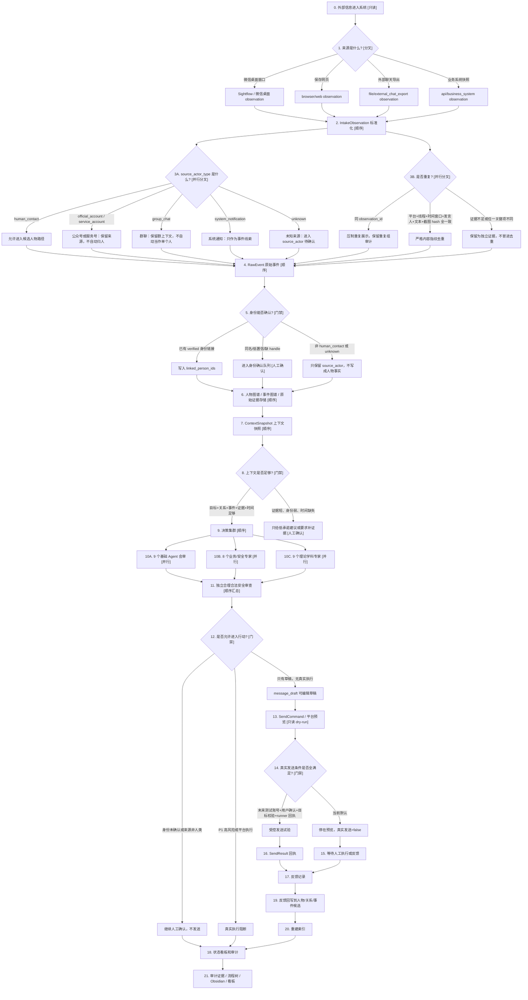

# 当前目标架构树

目标：完善并构建目标导向人际交互辅助系统理论篇，补齐跨学科审视、逐轮上下文、动态策略、通用事件流程、标签化检索存储体系，完成三类真实场景逐轮回测，并把理论回测与代码工程回测对齐为可验证闭环。

## 0. 当前结构树状流程图

```mermaid
flowchart TD
  root["目标导向人际交互辅助系统"]

  root --> main_loop["主闭环流程"]
  main_loop --> user_goal["用户目标"]
  user_goal --> relationship_context["人物关系"]
  relationship_context --> event_recording["事件记录"]
  event_recording --> decision_recommendation["决策建议"]
  decision_recommendation --> trigger_plan["触发计划"]
  trigger_plan --> platform_snapshot_validation["平台快照验证"]
  platform_snapshot_validation --> feedback["反馈"]
  feedback --> writeback["回写"]
  writeback --> index_rebuild["索引"]
  index_rebuild --> audit["审计"]

  root --> theory_engineering["图谱理论与工程对齐"]
  theory_engineering --> qa_summary["00 问答记录整理归纳"]
  theory_engineering --> theory_doc["01 理论篇"]
  theory_engineering --> engineering_doc["02 工程实现篇"]
  theory_engineering --> alignment_doc["03 理论与工程实现代码对齐篇"]
  theory_engineering --> architecture_tree["04 当前目标架构树"]
  theory_engineering --> theory_backtest["05 三类真实事件逐轮回测结果"]
  theory_engineering --> code_alignment_note["06 代码层工程实现与理论对齐说明"]
  theory_engineering --> code_backtest_result["07 理论与代码工程回测一致性结果"]
  theory_engineering --> three_layer_audit["三层审计代理配置"]

  root --> code_backtest["代码工程回测链"]
  code_backtest --> backtest_schema["GoalOrientedInteractionBacktest schema"]
  code_backtest --> backtest_runtime["goal-oriented-interaction-backtest runtime"]
  code_backtest --> backtest_script["run-goal-oriented-backtest script"]
  code_backtest --> backtest_tests["mvp-runtime backtest tests"]
  code_backtest --> backtest_artifacts["runtime/goal-oriented-backtests"]
  theory_backtest --> code_backtest
  code_backtest --> code_backtest_result
  code_backtest --> audit

  root --> mvp_evidence["MVP 验证证据链"]
  mvp_evidence --> pilot_readiness["试点导入前置门禁"]
  pilot_readiness --> pilot_import["试点样本导入"]
  pilot_import --> mvp_loop["MVP 闭环"]
  mvp_loop --> mvp_report["应用内报告页"]
  mvp_loop --> user_feedback["用户专项反馈二次优化"]
  mvp_loop --> self_agent["自代理预检"]
  self_agent --> input_kit["外部输入包"]
  input_kit --> input_templates["安全模板"]
  input_kit --> input_readiness["外部输入就绪校验"]
  input_readiness --> real_trial["真实输入受控试跑"]
  self_agent --> objective_audit["总目标逐项审计"]
  self_agent --> mvp_stress["MVP 全链路压力测试"]
  real_trial --> status_dashboard["统一状态看板"]
  objective_audit --> status_dashboard
  mvp_stress --> status_dashboard
  status_dashboard --> audit

  root --> governance["支撑治理"]
  governance --> engineering_entry["工程入口 README / docs/04"]
  governance --> document_governance["文档治理 docs/13 / docs/15"]
  document_governance --> machine_tree["examples/system-process-tree.json"]
  document_governance --> obsidian_md["views/obsidian/system-process-tree.md"]
  document_governance --> obsidian_canvas["views/obsidian/system-process-tree.canvas"]
  document_governance --> process_tree_validation["process-tree:validate"]
  process_tree_validation --> audit
  three_layer_audit --> audit

  root --> open_extensions["已登记开放扩展"]
  open_extensions --> pt003["PT-003 真实试点样本"]
  open_extensions --> pt004["PT-004 平台 dry-run 扩展"]
  open_extensions --> pt028["PT-028 实时亲密关系聊天辅助"]
  open_extensions --> pt029["PT-029 本机信息获取端口"]
  open_extensions --> pt030["PT-030 专家 Agent 选择机制"]
  open_extensions --> pt031["PT-031 主动进程与文化策略编排"]
```



这张图的读法：

- 主闭环说明系统从目标、关系、事件到决策、触发、反馈、回写和审计的执行顺序。
- 图谱理论与工程对齐说明 `tupu/00` 到 `tupu/07` 的文档产物如何递进。
- 代码工程回测链说明 `tupu/05` 的理论逐轮回测如何被 schema、runtime、script 和 test 变成可审计工程证据。
- 三层审计代理配置说明理论层、代码层和理论/代码对齐层分别由哪些代理审计，检查哪些证据，以及什么情况必须停止。
- MVP 验证证据链说明当前本地 MVP 如何从样本门禁、报告、外部输入、真实试跑、压测和状态看板证明闭环质量。
- 支撑治理说明机器流程树、Obsidian Markdown、Canvas 和 `process-tree:validate` 如何互证。

## 1. 真实系统数据走向理论树状图（非代码审查版）

本节给不懂代码的审查者使用。它只描述当前已经整理和实现到系统里的真实数据走向，不把未来想做但还没有门禁证据的能力画成已完成能力。

读图约定：

| 标记 | 含义 | 审查时怎么理解 |
| --- | --- | --- |
| `[顺序]` | 前一步完成后才进入下一步 | 数据必须按箭头顺序流动，不能跳过 |
| `[分叉]` | 根据条件只走其中一条或少数几条路径 | 看分叉条件是否清楚，是否会误判 |
| `[并行]` | 多个模块同时读取同一份上下文，各自给判断 | 并行意见不能互相覆盖，最后由审查层汇总 |
| `[门禁]` | 通过才能继续，失败则停下或转人工 | 这是防误判、防误发、防错写的关键位置 |
| `[人工确认]` | 系统只给建议，不把它当事实或不直接执行 | 适用于身份不清、风险高、发送前确认 |
| `[只读]` | 只接收、解析、预览，不对外部平台做动作 | 当前桌面端和多来源采集默认都是只读 |
| `[阻断]` | 明确禁止继续自动动作 | 当前真实发送默认阻断 |
| `[回写]` | 行动后把反馈和结果写回图谱 | 只有反馈进入后，下一轮才可作为新证据 |

### 1.1 总体数据走向树



### 1.2 逐层数据树

```text
0. 外部输入层
├─ 0.1 微信桌面窗口
│  ├─ 接收软件：Sightflow 桌面识别能力
│  ├─ 当前职责：只读观察、截图/OCR/窗口线索、生成 IntakeObservation
│  └─ 当前边界：不自己思考、不自己写图谱、不直接发送
├─ 0.2 保存网页
│  ├─ 来源：浏览器保存页或页面快照
│  └─ 进入同一 IntakeObservation 契约
├─ 0.3 外部聊天导出文件
│  ├─ 来源：用户保存的聊天文本或导出文件
│  └─ 作为 file/external_chat_export 只读来源
└─ 0.4 业务系统 API 快照
   ├─ 来源：用户提供的业务 JSON 快照
   └─ 作为 api/business_system 只读来源

1. IntakeObservation 标准化层
├─ 必备字段
│  ├─ observation_id：采集事件唯一编号
│  ├─ source_adapter_id：哪个接入器提供
│  ├─ source_type / platform：来源类别和平台
│  ├─ captured_at：采集时间
│  ├─ content_summary / content_text：摘要和可选正文
│  ├─ privacy_level：隐私等级
│  └─ confidence：来源置信度
├─ 并行派生 A：source_actor_type
│  ├─ human_contact：真实人类联系人
│  ├─ official_account：公众号
│  ├─ service_account：服务号或系统服务身份
│  ├─ group_chat：群聊或多人线程
│  ├─ system_notification：系统通知
│  └─ unknown：证据不足，默认值
├─ 并行派生 B：content_fingerprint
│  ├─ 平台
│  ├─ 线程
│  ├─ 时间窗口
│  ├─ 发言人
│  ├─ 标准化文本 hash
│  └─ 截图 hash
└─ 输出
   ├─ 标准化 observation
   ├─ 去重审计组
   └─ RawEvent 映射输入

2. 去重层
├─ 第一层：observation_id 完全相同
│  ├─ 判断：同一采集编号重复出现
│  ├─ 处理：只保留一个有效样本
│  └─ 审计：保留重复路径和重复组
├─ 第二层：严格内容指纹相同
│  ├─ 必须全部一致：平台、线程、时间窗口、发言人、文本、截图 hash
│  ├─ 处理：可压制重复
│  └─ 审计：记录 fingerprint、components、dedupe_ready
└─ 证据不足
   ├─ 缺 thread_key、speaker_key 或 screenshot_hash
   ├─ 不做内容指纹压制
   └─ 保留为独立证据，避免误删

3. 身份解析层
├─ human_contact
│  ├─ 可生成 ChannelIdentity
│  ├─ 可生成 PersonMatchCandidate
│  └─ 仍需 verified 链接或人工确认才写 linked_person_ids
├─ official_account / service_account
│  ├─ 作为来源上下文
│  └─ 不自动创建人物关系
├─ group_chat
│  ├─ 作为群线程上下文
│  └─ 不把群名当作单个人
├─ system_notification
│  ├─ 作为系统事件线索
│  └─ 不进入目标人物
└─ unknown
   ├─ 创建 source_actor_unknown
   ├─ 标记 source_actor_requires_confirmation
   └─ 决策可继续，但真实行动和事实写回必须人工确认

4. 图谱与事件层
├─ RawEvent：保留原始证据摘要、来源、时间、参与者、source_actor_type、content_fingerprint
├─ SemanticEvent：从原始事件中提取可解释线索
├─ People / Relationship：只接收已确认或明确候选
├─ Evidence：截图 hash、文件路径、网页快照、摘要、置信度
└─ Audit：每次读取、去重、确认、回写和阻断都可查

5. ContextSnapshot 上下文层
├─ goal：本轮目标和目标对象
├─ relationship_snapshot：目标人物、关系边、阶段、信任、健康度
├─ event_snapshot
│  ├─ event_timeline：语义事件时间线
│  ├─ raw_event_digest：逐条原始证据摘要
│  ├─ source_actor_type：每条证据的来源身份类型
│  └─ content_fingerprint：每条证据的去重证据
├─ decision_inputs：用户描述、候选事件数、约束和风险控制
├─ retrieval_reasons：系统为什么读取这些上下文
└─ context_sufficiency_score：上下文充分度

6. 决策和专家层
├─ 基础 Agent 并行
│  ├─ goal_agent：目标和最小成功标准
│  ├─ relationship_agent：关系阶段和行为准则
│  ├─ event_agent：事件线索和证据强度
│  ├─ norm_agent：隐私、合规和越界风险
│  ├─ option_agent：行动选项
│  ├─ skill_agent：系统技能或人工流程技能
│  ├─ roi_agent：成本、收益、风险和可观测性
│  ├─ evidence_agent：证据和待验证假设
│  └─ feedback_agent：复盘指标和回写规则
├─ 业务/安全专家并行
│  ├─ sales_strategy_expert：B2B 推进
│  ├─ customer_success_expert：客户成功和修复
│  ├─ relationship_boundary_expert：关系边界和压力风险
│  ├─ compliance_risk_expert：隐私、合同、钱款和合规
│  ├─ desktop_send_safety_expert：桌面发送安全和目标校验
│  ├─ identity_context_expert：身份解析和人物链接
│  ├─ culture_context_expert：文化、语气、时机、礼仪
│  └─ evidence_quality_expert：证据充分度和假设控制
└─ 理论学科专家并行
   ├─ game_theory_expert：博弈论
   ├─ psychology_expert：心理学
   ├─ logic_expert：逻辑学
   ├─ evidence_causality_expert：证据和因果
   ├─ social_network_expert：社会网络
   ├─ language_pragmatics_expert：语言语用学
   ├─ organizational_expert：组织管理
   ├─ behavioral_economics_expert：行为经济学
   └─ negotiation_conflict_expert：谈判和冲突

7. 行动与回写层
├─ message_draft：只生成可编辑草稿
├─ SendCommand：只有草稿、目标、平台、确认闸门齐备才可进入预览
├─ dry-run 预览：默认停在发送前
├─ controlled send：未来测试账号、用户确认、目标校验、runner 回执全满足才可试验
├─ FeedbackRecord：记录是否执行、是否回复、目标推进、关系变化、评分
├─ Writeback：反馈后生成关系/事件候选，不把未确认信息写成事实
├─ Index：按人物、关系、线程、目标、事件类型、风险、时间重建索引
└─ StatusDashboard：给人和外部系统看的当前状态入口
```

### 1.3 分叉条件总表

| 分叉点 | 可走路径 | 判断条件 | 当前系统处理 | 防误判设计 |
| --- | --- | --- | --- | --- |
| 来源分叉 | 微信桌面 / 网页 / 外部聊天导出 / 业务 API | `source_type`、`platform`、adapter capability | 四类 lane 共用 IntakeObservation 和 RawEvent | 新来源先过 adapter conformance，不改主流程 |
| 来源身份分叉 | human_contact / official_account / service_account / group_chat / system_notification / unknown | `source_actor_type`，缺失则 unknown | 只有 human_contact 可自动进入人物候选 | 公众号、服务号、群聊、系统通知和 unknown 不自动归人 |
| 去重分叉 | observation_id 去重 / 内容指纹去重 / 保留独立证据 | 是否同 id，或严格指纹六项是否全一致 | 同 id 可压制；内容指纹必须证据齐全 | 缺 thread、speaker、screenshot 时不冒进去重 |
| 身份分叉 | 已确认人物 / 待确认候选 / 来源上下文 | verified 身份链接、候选数量、置信度、source_actor_type | 未确认就进确认队列或 source_actor | 不把昵称、窗口标题、群名直接写成人物事实 |
| 上下文充分度分叉 | high / medium / low | 目标、关系、事件、证据文本、时间、目标人物是否齐 | 低证据时仍可生成低承诺草稿 | 不把短句当完整事实，保留补证据和人工确认 |
| 专家选择分叉 | 基础 Agent / 业务安全专家 / 理论学科专家 | 场景、风险、渠道、证据、身份状态等 trigger tags | 多组专家并行读取同一 ContextSnapshot | 并行意见进入审查层，不互相覆盖证据 |
| 独立审查分叉 | actionable_draft / needs_human_review / blocked_execution | 身份、平台、合规、自主性、审计、hard stop | 当前真实发送默认 false | 理论预测不被删除，但行动必须过审查 |
| 发送分叉 | dry-run 预览 / 受控发送 / 阻断 | 用户确认、目标校验、权限、测试窗口、runner 回执 | 默认停在 dry-run 或阻断 | 没有真实测试账号和回执不声明真实发送成功 |
| 反馈分叉 | 有反馈闭环 / 等待反馈 / 模板无效 | 是否存在真实 FeedbackRecord | 有反馈才进入回写和下一轮证据 | 模板、样例、未确认反馈不冒充真实反馈 |
| 状态分叉 | 可专项测试 / 可扩大真实连接器 / 等待外部输入 | 状态看板 blockers 和 readiness | 当前为可专项测试，不能扩大真实连接器 | 外部输入和真实试跑审计未完成时继续阻断 |

### 1.4 并行条件总表

| 并行组 | 并行成员 | 共同读取 | 输出 | 汇总位置 |
| --- | --- | --- | --- | --- |
| 多来源接入 lane | 微信桌面、网页、外部聊天导出、业务 API | 各自的只读 observation | RawEvent 预览、conformance、source matrix | `source_intake_matrix.v1` |
| 标准化派生 | 来源身份、内容指纹、RawEvent 映射、发送阻断标记 | 同一条 IntakeObservation | `source_actor_type`、`content_fingerprint`、RawEvent | intake runtime |
| 基础会审 Agent | 9 个基础 Agent | 目标、关系、事件、偏好、技能、反馈 | 可解释基础意见 | decision cluster |
| 业务/安全专家 | 8 个 specialist experts | 同一 ContextSnapshot 和 trigger tags | 风险、身份、发送、证据等专业意见 | parallel_expert_analysis.v1 |
| 理论学科专家 | 9 个 theory experts | 同一 ContextSnapshot | 理论预测、假设、反事实断点 | expert_matrix_analysis.v2 |
| 审计视图 | docs/15、system-process-tree.json、Obsidian Markdown、Canvas | 同一流程树登记 | 同步校验结果 | process-tree:validate |
| 运行状态视图 | 自代理、目标审计、来源矩阵、真实试跑、流程树、压测 | runtime 最新产物 | 统一状态和 blockers | mvp_status_dashboard.v1 |

### 1.5 当前真实运行快照

| 项目 | 当前证据 | 结论 |
| --- | --- | --- |
| 统一来源矩阵 | `runtime/source-intake-matrix/source_intake_matrix_20260616202819/source-intake-matrix.json` | 4 条来源 lane 已具备 conformance；总有效 observation 为 15；真实发送全部阻断 |
| 重复样本 | 同一 source matrix | 微信桌面 14 条 raw observation 压制为 12 条 effective observation；压制数 2；仍要求重复复核 |
| 最新桌面桥接 | `runtime/desktop-context-bridges/desktop_context_bridge_1781641719524_dfa760/desktop-context-bridge.json` | 最新真实桌面 observation 生成草稿和专家审查，但人物为 `source_actor_unknown`，需要人工确认 |
| ContextSnapshot | 同一目录 `context-snapshot.json` | `raw_event_digest` 已保留逐条原始证据摘要、`source_actor_type=unknown`、内容指纹缺 `thread_key` 和 `speaker_key` |
| 理论/代码回测 | `runtime/goal-oriented-backtests/goal_oriented_backtest_20260616203120/goal-oriented-interaction-backtest.json` | 3 类场景、12 轮，`theory_code_match_rate=1`，`hard_exit_signals=[]` |
| 流程树同步 | `runtime/process-tree-validations/process_tree_validation_20260616203218/process-tree-validation.json` | `process_tree_synced`，required/warning failures 为空 |
| 总状态 | `runtime/status-dashboards/mvp_status_dashboard_20260616203225/mvp-status-dashboard.json` | 本地目标证据完整，可专项测试；仍等待真实外部输入和真实试跑审计，不能扩大真实连接器 |

### 1.6 非代码审查者读图路线

1. 先看“来源分叉”：确认信息从哪里来，是否全部先变成 `IntakeObservation`。
2. 再看“来源身份分叉”：确认真实人、公众号、服务号、群聊、系统通知、未知来源不会混在一起。
3. 再看“去重分叉”：确认系统不会因为文字相似就删掉证据，必须满足严格条件。
4. 再看“ContextSnapshot”：确认模型输出不是只看拼接文本，而是同时读取目标、关系、事件、原始证据摘要和读取理由。
5. 再看“专家并行”：确认不同专家是并行审查同一份上下文，最后由独立审查判断能不能行动。
6. 最后看“发送和回写”：确认当前默认只生成草稿和 dry-run 预览，反馈进入后才回写图谱。

## 2. 目标树

```text
目标导向人际交互辅助系统理论完善
├─ A. 理论总纲
│  ├─ A1. V3 人际关系图谱定位
│  ├─ A2. 目标导向交互闭环
│  ├─ A3. 遗漏项检查
│  └─ A4. 完成标准
├─ B. 跨学科审视
│  ├─ B1. 心理学：情绪、意图、边界、依赖、修复
│  ├─ B2. 逻辑学：事实、证据、假设、推理、冲突
│  ├─ B3. 社会学：角色、权力、互惠、制度、社会资本
│  └─ B4. 人类学：文化、仪式、亲属、礼物、生命周期
├─ C. 目标对象模型
│  ├─ C1. TotalGoal
│  ├─ C2. ScenarioGoal
│  ├─ C3. TargetObjectGoal
│  └─ C4. ConversationRoundGoal
├─ D. 逐轮上下文模型
│  ├─ D1. 当日主题精炼
│  ├─ D2. 历史关系阶段
│  ├─ D3. 当前聊天焦点
│  ├─ D4. 对方侧重与情绪
│  ├─ D5. 目标对象目标
│  ├─ D6. 动态策略
│  ├─ D7. 证据与风险状态
│  └─ D8. 回写计划
├─ E. 动态策略模型
│  ├─ E1. 观察澄清
│  ├─ E2. 承接搭桥
│  ├─ E3. 价值先行
│  ├─ E4. 证据边界
│  ├─ E5. 条件交换
│  ├─ E6. 索取承诺
│  ├─ E7. 降温暂停
│  └─ E8. 安全退出
├─ F. 通用事件处理流程
│  ├─ F1. 输入与来源可信度
│  ├─ F2. 对象和关系边定位
│  ├─ F3. 事件类型与风险识别
│  ├─ F4. 指标与阶段更新候选
│  ├─ F5. 策略路径推演
│  ├─ F6. 人工确认门槛
│  └─ F7. 反馈回写与索引
├─ G. 标签化快速检索存储
│  ├─ G1. GlobalTaxonomy
│  ├─ G2. TargetDossiers
│  ├─ G3. ConversationThreads
│  ├─ G4. EventStore
│  ├─ G5. EvidenceStore
│  ├─ G6. Indexes
│  └─ G7. AuditTrail
└─ H. 回测验证
   ├─ H1. B2B 客户推进
   ├─ H2. 项目责任边界
   ├─ H3. 私人借钱与情绪压力
   └─ H4. 回测结论与遗漏复核
```

## 3. 产物树

```text
D:\zhineng\tupu
├─ 00-问答记录整理归纳.md
│  └─ 需求来源和问答中间推理保留
├─ 01-人际关系图谱理论篇.md
│  └─ 本轮优化后的目标导向系统理论篇
├─ 02-人际关系图谱工程实现篇.md
│  └─ 工程实现路径和模块落点
├─ 03-理论与工程实现代码对齐篇.md
│  └─ 理论到 JSON、schema、runtime、测试入口的对齐
├─ 04-当前目标架构树.md
│  └─ 本目标的结构树、产物树和存储树
├─ 05-三类真实事件逐轮回测结果.md
│  └─ 三类场景逐轮上下文、策略演化和回写结果
├─ 06-代码层工程实现与理论对齐说明.md
│  └─ 代码层回测 schema、runtime、script、测试和通过标准说明
└─ 07-理论与代码工程回测一致性结果.md
   └─ npm run tupu:backtest 生成的理论/代码一致性摘要
```

## 4. 存储架构树

```text
RelationshipKnowledgeVault
├─ GlobalTaxonomy
│  ├─ relationship_types
│  ├─ risk_tags
│  ├─ context_tags
│  ├─ function_tags
│  ├─ event_types
│  └─ dialogue_acts
├─ TargetDossiers
│  └─ target_id
│     ├─ target_profile
│     ├─ relationship_edges
│     ├─ target_goals
│     ├─ current_strategy_state
│     ├─ open_commitments
│     └─ risk_boundary_policy
├─ ConversationThreads
│  └─ thread_id
│     ├─ daily_topic_summary
│     ├─ turn_records
│     ├─ context_snapshots
│     ├─ generated_message_drafts
│     └─ strategy_transitions
├─ EventStore
│  ├─ raw_events
│  ├─ semantic_events
│  ├─ feedback_events
│  └─ writeback_events
├─ EvidenceStore
│  ├─ evidence_refs
│  ├─ confidence_records
│  ├─ source_metadata
│  └─ privacy_levels
├─ Indexes
│  ├─ by_target
│  ├─ by_edge
│  ├─ by_thread
│  ├─ by_goal
│  ├─ by_event_type
│  ├─ by_risk_tag
│  ├─ by_context_tag
│  ├─ by_dialogue_act
│  └─ by_time
└─ AuditTrail
   ├─ read_reasons
   ├─ decision_reasons
   ├─ manual_confirmation_gates
   ├─ metric_update_records
   └─ strategy_change_records
```

## 5. 节点验收表

| 节点 | 验收标准 | 产物 |
| --- | --- | --- |
| 理论总纲 | 能解释目标导向闭环和 V3 图谱关系 | `01-人际关系图谱理论篇.md` |
| 跨学科审视 | 心理学、逻辑学、社会学、人类学均有明确检查项 | `01-人际关系图谱理论篇.md` |
| 逐轮上下文 | 明确当日主题、历史阶段、当前焦点、对方侧重情绪、目标、策略和回写 | `01`、`05` |
| 动态策略 | 策略会随话轮变化 | `01`、`05` |
| 通用事件流程 | 覆盖普通互动、支持、承诺、边界、财务、法律、冲突、安全、修复、终止 | `01` |
| 存储体系 | 集中但区分目标对象，标签化且可快速检索 | `01`、`04` |
| 真实系统数据走向树 | 能让非代码审查者看清输入、分叉、并行专家、门禁、发送阻断、反馈回写和状态看板 | `04` |
| 三类回测 | 三个不同场景均有逐轮上下文、策略和回写 | `05` |
| 代码工程回测 | 三个场景十二轮均能被代码解析，理论/代码签名一致，草稿和回写完整 | `06`、`07`、`runtime/goal-oriented-backtests/**` |
| 三层审计代理 | 理论层、代码层和对齐层均有审计代理，且每个代理明确读取证据、检查项、输出项和硬退出条件 | `schemas/theory-code-alignment-audit-agents.schema.json`、`knowledge/audit-agents/theory-code-alignment-audit-agents.json` |
| 流程树验证 | 文档、机器树、Obsidian Markdown 和 Canvas 同步，required/warning failures 为空 | `runtime/process-tree-validations/**` |

## 6. 三层审计代理配置

三层实现规则：

```text
理论层：回答为什么、边界是什么、哪些暂不实现
代码层：回答怎么跑、怎么测、失败在哪里停
对齐层：回答理论说的和代码跑的是不是一套
```

代理配置文件：

- `schemas/theory-code-alignment-audit-agents.schema.json`
- `knowledge/audit-agents/theory-code-alignment-audit-agents.json`

当前审计代理：

| 层级 | 代理 | 审计重点 |
| --- | --- | --- |
| 理论层 | `theory_goal_boundary_auditor` | 总目标、阶段目标、复杂场景边界、暂不实现项和接口预留 |
| 理论层 | `theory_context_event_auditor` | 人物、组织、事件、关系、上下文、证据、风险和回写闭环 |
| 代码层 | `code_contract_runtime_auditor` | schema、runtime、script、test、运行产物和 dry-run 闸门 |
| 代码层 | `code_storage_index_auditor` | 业务存储、运行状态、索引重建和审计可读性 |
| 对齐层 | `alignment_signature_auditor` | 理论回测与代码工程回测签名、指标、草稿和回写一致性 |
| 对齐层 | `alignment_process_tree_auditor` | 流程树、Obsidian、文件登记、问题台账和同步校验 |

当前缺口：

- 缺少读取该配置并输出 `theory_code_alignment_audit_report.v1` 的自动审计 runtime。
- 理论层新增的思维图谱、能力库、心跳调度和复杂群体场景仍缺 schema/runtime/test。
- 代码层仍缺实时对象匹配、上下文编排器、目标状态机、专家选择器和能力库执行注册表。
- 对齐层仍缺实时输入链路、真实图谱回写、专家权重变化和心跳调度行为的对齐回测。

## 7. 验证命令

本结构图修改后需要验证两层：

```powershell
npm run tupu:backtest
npm run process-tree:validate
```

如果同时改动回测运行时代码或流程树校验代码，还需要运行：

```powershell
node --test packages/mvp-runtime/tests/*.test.mjs
```

完成标准：

- `goal_oriented_interaction_backtest.v1.gate_decision=goal_oriented_backtest_passed`
- `theory_code_match_rate=1`
- `hard_exit_signals=[]`
- `process_tree_validation.v1.gate_decision=process_tree_synced`
- `required_failures=[]`
- `warning_failures=[]`
