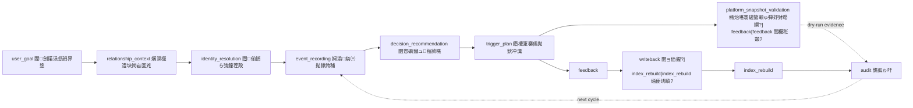

# Sync Rule

## Cloud Source Mirror

- Node: `cloud_source_mirror`
- Remote: `huay7380-beep/zy`
- Local clone for publishing: `D:\zbx\zy`
- Policy doc: `docs/21-cloud-github-sync-plan.md`
- Manifest command: `npm run cloud:sync:manifest`
- Boundary: source-first Git mirror; excludes `third_party/**`, `**/node_modules/**`, `**/runtime/**`, `tmp/**`, `.env*`, large model weights, binary libraries, installers, generated logs and caches.

Keep examples/system-process-tree.json, docs/15-系统流程树与扩展问题台账.md, views/obsidian/system-process-tree.md and views/obsidian/system-process-tree.canvas synchronized. Run npm run process-tree:validate after changes.

## Relationship/Event Graph Storage Plans

- `docs/18-relationship-event-graph-memory-plan.md`: formal memory boundary for the human relationship graph and event graph. Future relationship or event graph work must read this first.
- `docs/19-source-collection-classified-storage-plan.md`: formal data collection classified storage plan covering local SourceArchive, semantic NestedEvent, rule WeightProfile, V0-V5 visual weight levels and read-only NebulaProjection.
- `docs/20-relationship-event-graph-phased-execution-plan.md`: confirmed P0-P10 phase execution plan. P0-P9 uses `npm run relationship-event:phases`; user-confirmed P10 shadow mode uses `npm run relationship-event:p10-shadow`; learning-weight review uses `npm run relationship-event:promotion-confirmation`; validation uses `npm run relationship-event:validate` and `npm run relationship-event:promotion-confirmation:validate`.
- Boundary: these plans define source preservation, relationship-update confirmation gates, P10 learning-weight shadow reports, learning-weight promotion confirmation packs and read-only nebula projection. They do not authorize relationship-state changes, identity merges, learning-weight promotion, limited trial execution or external actions by themselves.

# 娴滆櫣琚粈鍙ユ唉鏉堝懎濮化鑽ょ埠濞翠胶鈻奸弽?
閺夈儲绨敍?
- 娑撹鍙嗛崣锝忕窗[docs/15-缁崵绮哄ù浣衡柤閺嶆垳绗岄幍鈺佺潔闂傤噣顣介崣鎷屽](../../docs/15-缁崵绮哄ù浣衡柤閺嶆垳绗岄幍鈺佺潔闂傤噣顣介崣鎷屽.md)
- 閺堝搫娅掔槐銏犵穿閿涙瓟examples/system-process-tree.json](../../examples/system-process-tree.json)
- Canvas 鐟欏棗娴橀敍姝攕ystem-process-tree.canvas](system-process-tree.canvas)

閸氬本顒炵憴鍕灟閿涘澃ync rule閿涘绱版穱顔芥暭娑撶粯绁︾粙瀣ㄢ偓浣藉Ν閻愬湱濮搁幀浣碘偓渚€妫舵０妯哄酱鐠愶负鈧焦鏋冩禒璺哄閼崇晫娅ョ拋鐗堝灗閺傛澘顤冩潻鎰攽娴溠呭⒖閺冭绱濊箛鍛淬€忛崥灞绢劄閺囧瓨鏌婇張顒佹瀮娴犺泛鎷?`system-process-tree.canvas`閿涘苯鑻熸潻鎰攽 `npm run process-tree:validate`閵?


## 闂傤噣顣介崣鎷屽

| ID | 閻樿埖鈧?| 閹芥顩?|
| --- | --- | --- |
| PT-001 | closed | 閸樼喎顫愰弬鍥ㄣ€傞崚鍡樻殠閿涘苯鍑℃潻浣盒╂稉?docs/00-17 閸滃本绁︾粙瀣埐閸忋儱褰涢妴?|
| PT-002 | closed | 缁楊兛绔撮梼鑸殿唽閻╊喗鐖ｆ潏鍦櫕瀹告彃缍婇獮璺哄煂 docs/05閵嗕龚ocs/10 閸滃本绁︾粙瀣埐閵?|
| PT-003 | in_progress | 濮濓絽绱＄拠鏇犲仯閺嶉攱婀伴弫浼村櫤娑撳秷鍐婚敍灞界窡閻喎鐤勯弽閿嬫拱鐞涖儵缍堥妴?|
| PT-004 | in_progress | 閼奉亜濮╅崠鏍暕鐟欏牅绮涙稉?dry-run閿涘苯绶熼惇鐔风杽楠炲啿褰村ù瀣槸鐠愶箑褰胯箛顐ゅ弾閵?|
| PT-005 | closed | 娴滆櫣澧挎稉搴濈皑娴犺泛鐡ㄩ崒銊╊€囬弸璺哄嚒瑜版帒鑻熼崚?docs/12閵?|
| PT-006 | closed | 閸愬磭鐡ラ梿鍡欏參閸滃奔绗撶€硅埖娼堥柌宥呭弳閸欙絽鍑¤ぐ鎺戣嫙閸?docs/07閵嗕龚ocs/08閵?|
| PT-007 | closed | 鐟欙箑褰傜拋鈥冲灊閸滃奔姹夊銉р€樼拋銈嗙閸楁洖鍑¤ぐ鎺戣嫙閸?docs/09閵?|
| PT-008 | closed | 閺傚洦銆傛禍鎺曠槈閸滃苯缍婇獮鎯邦潐閸掓瑥鍑¤ぐ鎺戣嫙閸?docs/13閵?|
| PT-009 | closed | 闂傤厾骞嗛弽铚傜伐閺勭姴鐨犻崪灞肩閼峰瓨鈧冾吀閺屻儱鍑¤ぐ鎺戣嫙閸?docs/14閵?|
| PT-010 | closed | 閻劍鍩涙稉鎾汇€嶅ù瀣槸閸欏秹顩鑼波閺嬪嫬瀵查幒銉ュ弳閵?|
| PT-011 | closed | 閹恒劏宕橀崝銊ょ稊濡剝婢橀崪灞兼眽瀹搞儲澧界悰灞剧閸楁洖鍑￠幒銉ュ弳閵?|
| PT-012 | closed | MVP 鐎瑰本鍨氭惔锕€顓哥拋鈥冲弳閸欙絽鍑￠幒銉ュ弳閵?|
| PT-013 | closed | 闂傤厾骞嗛弽铚傜伐缂傛牜鐖滈幑鐔锋綎瀹稿弶绔婚悶鍡愨偓?|
| PT-014 | closed | 閼奉亙鍞悶鍡涱暕濡偓閸忋儱褰涘鍙夊复閸忋儯鈧?|
| PT-015 | closed | 濞翠胶鈻奸弽鎴濇倱濮濄儲鐗庢灞藉嚒閹恒儱鍙嗛妴?|
| PT-016 | closed | 閼奉亙鍞悶鍡涱暕濡偓瀹歌尪顔囪ぐ鏇熺ウ缁嬪鐖查弽锟犵崣鐠囦焦宓侀妴?|
| PT-017 | closed | MVP 閸忋劑鎽肩捄顖氬竾閸旀稒绁寸拠鏇炲嚒閹恒儱鍙嗛妴?|
| PT-018 | closed | 閼奉亙鍞悶鍡楁嫲鐎孤ゎ吀閹笛嗩攽妞ゅ搫绨鑼额唶瑜版洏鈧?|
| PT-019 | closed | 閼奉亙鍞悶鍡涱暕濡偓瀹歌尙鎾奸崗銉ュ竾閸旀稒绁寸拠鏇＄槈閹诡喓鈧?|
| PT-020 | closed | 閻劍鍩涢惄顔界垼閸ョ偤銆愮€瑰本鏆ｉ幀褍鍑＄痪鍐插弳鐎孤ゎ吀閵?|
| PT-021 | closed | 婢舵牠鍎存潏鎾冲弳娴溿倖甯撮崠鍛嚒閹恒儱鍙嗛妴?|
| PT-022 | closed | 婢舵牠鍎存潏鎾冲弳 readiness 閺嶏繝鐛欏鍙夊复閸忋儯鈧?|
| PT-023 | closed | 婢舵牠鍎存潏鎾冲弳鐎瑰鍙忓Ο鈩冩緲瀹稿弶甯撮崗銉ｂ偓?|
| PT-024 | closed | 閹崵娲伴弽鍥偓鎰般€嶇€孤ゎ吀瀹稿弶甯撮崗銉ｂ偓?|
| PT-025 | closed | 閻喎鐤勬潏鎾冲弳閸欐甯?MVP 鐠囨洝绐囧鍙夊复閸忋儯鈧?|
| PT-026 | closed | 閻喎鐤勬潏鎾冲弳鐠囨洝绐?HTML 閹躲儱鎲℃い闈涘嚒閹恒儱鍙嗛妴?|
| PT-027 | closed | MVP 缂佺喍绔撮悩鑸碘偓浣烘箙閺夊灝鍑￠幒銉ュ弳閵?|
| PT-028 | open | 娴滄彃鐦戦崗宕囬兇 v1 playbook 瀹稿弶甯撮崗銉幢`romantic_goal_analysis.v1`閵嗕梗romantic_expert_sentence_review.v1`閵嗕梗expert_context_pack.v1`閵嗕梗parallel_expert_run_log.v1`閵嗕梗romantic_relationship_coordinator_expert.v1`閵嗕梗frontend_display_contract.v1`閵嗕梗send_gate_transfer_path.v1`閵嗕礁鍙х化缁橆潽鎼达负鈧礁绺鹃悶鍡氬灊闁倸瀹抽妴浣稿綖鐎涙劖鍓伴崶淇扁偓浣侯儑娑撳鏌熼幓鎰仛閵嗕浇闊╂禒鑺ョ垼缁涙儳褰查柅澶堚偓浣圭ゴ鐠囨洖顕挒锟犳缁傛眹鈧椒绗傛稉瀣瀮娑撳秷鍐荤拠濠冩焽閵嗕浇鍤滈崝銊ュ絺闁線妯嗛弬顓濈瑓閻ㄥ嫰绮拋銈呭敶鐎硅褰佺粈铏圭摜閻ｃ儯鈧胶娲伴弽鍥︽櫠閸?PUA 娑撳海鏁ら幋铚傛櫠鐎瑰鍙忕€光剝鐗抽幏鍡楀瀻閵嗕胶娲伴弽鍥ь嚠鐠烇繝鈧劕褰炴稉鎾愁啀鐠囧嫬顓搁崪宀€婀＄€圭偛褰傞柅渚€妯嗛弬顓炲灥閻楀牆鍑￠幒銉ュ弳 decision-cluster閿涙矖docs/17` 瀹稿弶鏌婃晶鐐翠罕閻栧彉绗撶€硅埖顫惔锔绢吀閻?V2閿涘瞼娅ョ拋鎵殠娑?O0-O7閵嗕胶鍤庢稉?F0-F7閵嗕線鍊嬬痪锕佹祮閸︽亽鈧浇顫嗛棃銏犳倵婢跺秶娲忛妴浣藉Ν婵傚繑婧€閸掕泛鎷版潻椋庢暫閺傝纭堕惃鍕讲閻?/ 缁備胶鏁ゆ潏鍦櫕閿涙矂2 娴狅絿鐖滅€涙顔屽鍙夊复閸?`online_offline_progression_track.v1`閵嗕梗date_transition_readiness.v1`閵嗕梗romantic_progression_cadence.v1`閿涘本鍋撳ù顔剧崶閻厾濮搁幀浣稿磳缁狙傝礋 `R*/O*/F* 璺?current_turn_intent 璺?gate_status`閿涙矖pt028_gui_decision_state.v1` 瀹稿弶濡搁惇鐔风杽 runtime 閸愬磭鐡ラ幎鏇炲閸?Sightflow GUI閿涘苯褰х拠璇茬潔缁€铏诡儑娑撯偓娴滆櫣袨閼藉顭堥妴浣烘暏閹撮攱甯归悶鍡樻）韫囨ぜ鈧胶顑囨稉澶嬫煙閹绘劗銇氶妴浣风瑩鐎规湹绗傛稉瀣瀮閸栧懌鈧礁鑻熺悰宀冪箥鐞涘本妫╄箛妞尖偓浣逛罕娴滃搫鍙х化鑽ょ埠缁涢€涚瑩鐎硅翰鈧焦鍋撳ù顔剧崶閻厾濮搁幀浣碘偓浣瑰付閸掕泛褰寸拠锔芥▔閺冦儱绻旈妴浣稿絺闁線妫梼鈧妴浣哥暚閺佹挳鎽肩捄顖濊泲閸氭垵鎷伴崚鍡樻暜鐠佹澘缍嶉敍娌梡t028_gui_event_stream.v1`閵嗕讣ightflow `zhineng:decision-state:changed` 娴ｅ骸娆㈡潻鐔稿腹闁降鈧梗pt028_multi_window_feedback_calibration.v1` dry-run 娑撳鐛ラ崣锝夋缁傜粯鐗庨崙鍡楁嫲 `pt028_final_special_acceptance.v1` final acceptance gate, `pt028_real_feedback_workpack.v1` real feedback workpack, `pt028_candidate_source_lane_summary.v1` multi-source lane summary, `pt028_acceptance_closure_plan.v1` 閺€璺哄經鐠佲€冲灊, `pt028_missing_target_collection_plan.v1` missing-target collection plan, `pt028_final_feedback_decision_pack.v1` HTML operator report and `pt028_operator_feedback_window_checklist.v1`, `pt028_feedback_confirmation_preflight.v1`, `npm run pt028:feedback-workpack`, `npm run pt028:feedback-confirm:preflight` and `npm run pt028:feedback-decision-pack` have been wired閿涙被0-R6/RX 闂冭埖顔屾稉鎾汇€嶅ù瀣槸瀹歌尪顩惄鏍电礉`npm run pt028:audit` 閸欘垳鏁撻幋鎰箛閺堝顔囪ぐ鏇⑩偓鎰般€嶉崶鐐存杹閸滃苯鍨庨弨顖濐唶瑜版洘濮ら崨濠忕幢閸忣噣顤佹禒鍛稊娑撳搫娲栬ぐ鎺撶ゴ鐠囨洖銇欓崗鐤嚛閺勫函绱濇稉宥堢箻閸忋儵鈧氨鏁ょ€圭偟骞囬妴鍌氱秼閸撳秳绮?open閿涙氨婀＄€圭偛顦跨粣妤€褰?operator feedback 閸滃奔姹夊銉ょ瑩妞ゅ湱绮撶€光€茬矝瀵板懓藟姒绘劧绱濋惇鐔风杽閸欐垿鈧胶鎴风紒顓㈡▎閺傤厹鈧?|
| PT-028a | closed | 閺傛澘顕挒掳鈧浇闊╂禒鑺ユ弓绾喛顓婚幋鏍х秼閸撳秵绉烽幁顖欑瑝閸欘垵顕伴弮璺哄嚒缂佺喍绔存潻娑樺弳 `context_capture_hint`閿涙稑鍘涚涵顔款吇娴滆櫣澧块妴浣虹崶閸欙絻鈧礁鍙х化璇测偓娆撯偓澶嬬垼缁涙儳鎷拌ぐ鎾冲濞戝牊浼呴敍灞藉晙閸忎浇顔忛崗宕囬兇闂冭埖顔岄幒銊ㄧ箻閹存牕顕径鏍磸缁嬭￥鈧?|
| PT-028b | closed | 瀹稿弶鏌婃晶?`romantic_relationship_goal_contract.v1`閿涘本濡?R6 閺堚偓缂佸牆鍙х化鑽ゆ窗閺嶅洢鈧礁缍嬮崜宥夋▉濞堥潧妯婄捄婵勨偓浣哥秼閸撳秷鐤嗘稉鈧梼鏈靛瘜閸斻劍甯规潻娑氭窗閺嶅洢鈧礁鍙挎担鎾茬瑓娑撯偓濮濄儱缂撶拋顔兼嫲閸欏秹顩崶鐐插晸閹稿洦鐖ｉ幒銉ュ弳娑撴挸顔嶉惌鈺呮█閿涙被2/R3 缁涘褰查幒銊ㄧ箻闂冭埖顔屾稉宥呭晙闁偓閸栨牔璐熼崣顏囶潎鐎电喆鈧?|
| PT-028c | closed | 瀹稿弶鏌婃晶?`relationship_gradient_framework.v1`閵嗕梗romantic_stage_gradient.v1`閵嗕梗psychological_comfort_model.v1`閵嗕梗dialogue_intent_contract.v1` 閸滃瞼顑囨稉澶嬫煙閹绘劗銇氶崡鈽呯幢姒涙顓婚懡澶岊焾閹稿绺鹃悶鍡氬灊闁倹顫惔锕€浜曢幒銊ㄧ箻閿涘矂鐝悜顓炲娴滄彃鐦戦棃鐘虹箮閸欘亙缍旀稉鍝勵槵闁鈧?|
| PT-029 | open | 婢舵碍娼靛┃鎰攽闂堫澀淇婇幁顖涘复閸忋儱鎷伴崣妤佸付閻喎鐤勯崣鎴︹偓浣风矝瀵板懐婀＄€圭偞绁寸拠鏇犵崶閸欙綁鐛欓弨韬测偓?|
| PT-030 | closed | 娑撴挸顔?Agent 缁鐎烽妴浣烘窗閺嶅洤顕挒锟犳▉濞堝灚鈧傜瑐娑撳鏋冮崚鍡樼€介崪灞肩瑩鐎硅埖娼堥柌宥嗘殻閸氬牆鍑＄悰銉╃秷閵?|
| PT-031 | open | 娑撹濮╂潻娑氣柤鐎瑰甯撴禒宥呯窡閻喎鐤勯崣宥夘洯閺嶁€冲櫙閵?|

## 閺傚洣娆㈤崗銉ュ經

| 閺傚洣娆?| 娴ｆ粎鏁?|
| --- | --- |
| [docs/15](../../docs/15-缁崵绮哄ù浣衡柤閺嶆垳绗岄幍鈺佺潔闂傤噣顣介崣鎷屽.md) | 娴滆櫣琚崣顖濐嚢濞翠胶鈻奸弽鎴欌偓渚€妫舵０妯哄酱鐠愶箑鎷伴弬鍥︽閻ф槒顔?|
| [docs/16](../../docs/16-婢舵碍娼靛┃鎰繆閹垱甯撮崗銉ょ瑢閸欐甯堕崣鎴︹偓浣烘窗閺嶅洤鐤勯悳鐗堟瀮濡?md) | PT-029 婢舵碍娼靛┃鎰繆閹垱甯撮崗銉ｂ偓涓糹ghtflow 濡椼儲甯撮崪灞藉綀閹貉冨絺闁線鐛欑拠浣规煙濡?|
| [docs/17](../../docs/17-閻╊喗鐖ｅù浣衡柤娴狅絿鐖滄稉鈧懛瀛樷偓褌绗屾稉鎾愁啀鐠囧嫪鍙婇惌鈺呮█閺夋劖鏋?md) | 閻炲棜顔戦妴浣峰敩閻降鈧椒绗撶€瑰墎鐓╅梼闈涱吀閺屻儲娼楅弬娆忔嫲閹鍩嶆稉鎾愁啀濮婎垰瀹崇粻锛勬倞 V2 |
| [閸掑棗鐪扮憴鍕壐妞瑰崬濮?Agent 缁崵绮烘稉鎾汇€嶉弬瑙勵攳](../../娑撴捇銆嶉弬瑙勵攳-閸掑棗鐪扮憴鍕壐妞瑰崬濮〢gent缁崵绮?妞ゅ湱娲伴弬瑙勵攳.md) | 閻╊喗鐖ｉ弫娆忕瑎鐏炲倶鈧胶绮ㄩ弸鍕鐟欏嫭鐗搁弽鎴欌偓浣鼓侀崸?manifest閵嗕椒绗傛稉瀣瀮鐠嬪啫瀹抽妴浣稿綁閺囨挳妞勯梻銊ユ嫲濞村鐦拠浣瑰祦闁剧偓鏌熷▔鏇☆啈 |
| [PT-028 鐎孤ゎ吀閼存碍婀癩(../../scripts/audit-pt028-romantic-flow.mjs) | 閹姹夐崗宕囬兇濞翠胶鈻肩€孤ゎ吀閸滃瞼骞囬張澶庮唶瑜版洟鈧劙銆嶉崶鐐存杹閸忋儱褰?|
| [PT-028 鐎孤ゎ吀娴溠呭⒖](../../runtime/pt028-audits) | `pt028_romantic_flow_audit.v1` JSON/Markdown 鐠囦焦宓侀惄顔肩秿 |
| [PT-028 GUI 閸愬磭鐡ラ悩鑸碘偓涔?../../runtime/pt028-gui-decision-states) | `pt028_gui_decision_state.v1` GUI 閸欘垵顕伴幎鏇炲閿涘苯瀵橀崥顐ゎ儑娑撯偓娴滆櫣袨閼藉顭堥妴浣侯儑娑撳鏌熼幓鎰仛閵嗕椒绗撶€规湹绗傛稉瀣瀮閸栧懌鈧礁鑻熺悰宀冪箥鐞涘本妫╄箛妞尖偓浣虹埠缁涢€涚瑩鐎硅翰鈧礁澧犵粩顖氱潔缁€鍝勵殩缁撅负鈧礁褰傞柅渚€妫梼鈧妴渚€鎽肩捄顖濊泲閸氭垵鎷伴崚鍡樻暜鐠佹澘缍?|
| [PT-028 GUI 娴滃娆㈠ù涔?../../runtime/pt028-gui-event-streams) | `pt028_gui_event_stream.v1` 娴ｅ骸娆㈡潻鐔剁皑娴犺埖绁︾拠浣瑰祦閿涘苯瀵橀崥?IPC 閹恒劑鈧線鈧岸浜鹃妴浣规瀮娴犲墎娲冮崥顑锯偓浣界枂鐠囥垹娲栭柅鈧崪灞藉絺闁線妯嗛弬顓ㄧ幢閺€顖涘瘮娴?collection session 妫板嫮绮︾€规艾顦跨粣妤€褰?state_path閿涘本鍨ㄦ禒搴ｆ埂鐎?feedback 閹佃顐奸悽鐔稿灇閺堚偓缂佸牓鐛欓弨鏈电皑娴犺埖绁?|
| [PT-028 real observation GUI states](../../runtime/pt028-real-observation-gui-states) | `pt028_real_observation_gui_states.v1` candidate GUI states, target coverage and event-stream preview generated from real desktop observation refs, without writing real feedback target |
| [PT-028 real feedback workpack](../../runtime/pt028-real-feedback-workpacks) | `pt028_real_feedback_workpack.v1` operator worksheet with multi-source candidate observation refs, `pt028_candidate_source_lane_summary.v1`, candidate-prefilled draft `evidence_refs` and `state_path`, `pt028_acceptance_closure_plan.v1`, `pt028_missing_target_collection_plan.v1`, window review tasks, latest evidence refs and no target-write boundary |
| [PT-028 real feedback confirmations](../../runtime/pt028-real-feedback-confirmations) | `pt028_real_feedback_confirmation.v1` confirmation decision templates and controlled target-write reports; default runs write no real feedback target, confirmed runs recheck readiness and keep real sending blocked |
| [PT-028 feedback confirmation preflights](../../runtime/pt028-feedback-confirmation-preflights) | `pt028_feedback_confirmation_preflight.v1` safe confirmation-template diagnostics with readiness summary, missing field groups, next commands and no target-write/no-send boundary |
| [PT-028 acceptance chains](../../runtime/pt028-acceptance-chains) | `pt028_acceptance_chain.v1` ordered confirmation, feedback-bound event stream, readiness, calibration, audit and final-acceptance chain reports |
| [PT-028 acceptance statuses](../../runtime/pt028-acceptance-statuses) | `pt028_acceptance_status.v1` read-only current status with low-latency stream counts/input-mode/latency summary, real feedback gates, human-review handoff freshness, review-sheet diagnostics, `pt028_human_review_fill_plan_summary.v1`, `pt028_operator_action_queue.v1` and feedback collection handoff/session/coverage summary |
| [PT-028 operator acceptance handoffs](../../runtime/pt028-operator-acceptance-handoffs) | `pt028_operator_acceptance_handoff.v1` read-only final operator handoff with acceptance status refs, final review refs, human review sheet refs, `pt028_operator_quickstart.v1`, `pt028_operator_action_queue.v1`, event-stream and feedback-collection summaries, next human actions and no target-write/no-send/no-approval boundary |
| [PT-028 operator handoff refresh chains](../../runtime/pt028-operator-handoff-refresh-chains) | `pt028_operator_handoff_refresh_chain.v1` ordered read-only refresh report; when a real feedback target exists it runs feedback-bound acceptance-chain first, then refreshes final-review-pack, human-review-decision template/check-only, optional auto controlled preflight, acceptance-status and operator-handoff, with default review target/default real feedback target auto-detection, generated decision/finalization command summary, `pt028_human_review_fill_plan_summary.v1`, `pt028_operator_quickstart_summary.v1`, `pt028_operator_action_queue_summary.v1` and no finalization/no target-write/no-send boundary |
| [PT-028 operator next steps](../../runtime/pt028-operator-next-steps) | `pt028_operator_next_step.v1` read-only current action report from latest refresh/handoff/status, with `pt028_operator_objective_progress.v1` tracks and `pt028_operator_completion_gate.v1` fail-on-incomplete evidence for low-latency event stream, real multi-window feedback calibration and final special acceptance, normalized queue, current action, next blocking action, target status, next commands and no finalization/no target-write/no-send boundary |
| [Sightflow GUI acceptance gate](../../sightflow-desktop-agent-main/src/renderer/src/zhineng-console/README.md) | Read-only GUI path: `zhineng:decision-state:get` attaches latest `pt028_operator_next_step.v1` / `pt028_operator_completion_gate.v1`; the dock shows `R*/O*/F* · current_turn_intent · gate_status`, and the console shows Acceptance Gate blockers without writing `runtime/user-inputs/**` or sending messages |
| [PT-028 final feedback decision packs](../../runtime/pt028-final-feedback-decision-packs) | `pt028_final_feedback_decision_pack.v1` consolidated operator entry with readable HTML report, window-level feedback checklist, refreshed workpack, confirmation template, acceptance-chain failures, required human actions, next commands and no target-write/no-send boundary |
| [PT-028 feedback handoff validations](../../runtime/pt028-feedback-handoff-validations) | `pt028_feedback_handoff_validation.v1` read-only checks for operator HTML, window checklist, confirmation template, preflight, acceptance-chain artifacts and no target-write/no-send boundary |
| [PT-028 feedback collection sessions](../../runtime/pt028-feedback-collection-sessions) | `pt028_feedback_collection_session.v1` read-only per-window operator collection tasks with decision-template pointers, evidence refs, next commands and no target-write/no-send boundary |
| [PT-028 feedback collection coverages](../../runtime/pt028-feedback-collection-coverages) | `pt028_feedback_collection_coverage.v1` read-only task-to-decision coverage checks before confirmation preflight |
| [PT-028 real feedback finalizations](../../runtime/pt028-real-feedback-finalizations) | `pt028_real_feedback_finalization.v1` controlled runner for coverage, preflight, target write, feedback-bound event stream, readiness, calibration and acceptance-chain |
| [PT-028 閻喎鐤勯崣宥夘洯鐏忚京鍗庨弽锟犵崣](../../runtime/pt028-real-feedback-readiness) | `pt028_real_feedback_readiness.v1` 閺嶏繝鐛欓惇鐔风杽閸欏秹顩弬鍥︽閵嗕礁宕版担宥囶儊閵嗕胶鐛ラ崣?閻╊喗鐖ｉ崬顖欑閹佲偓浣哄Ц閹浇鐭惧鍕┾偓浣界槈閹诡喖绱╅悽銊ｂ偓涔竢ompt-only 闂冪粯鏌囬崪灞兼眽瀹搞儰绗撴い鍦€樼拋?|
| [PT-028 婢舵氨鐛ラ崣锝呭冀妫ｅ牊鐗庨崙鍝?../../runtime/pt028-feedback-calibrations) | `pt028_multi_window_feedback_calibration.v1` 閼峰啿鐨稉銈囩崶閸欙絻鈧浇鍤︾亸鎴滆⒈娑擃亜鏁稉鈧惄顔界垼閵嗕礁顦跨粣妤€褰涢惄顔界垼闂呮梻顬囬妴涔穚erator feedback 閸滃矁濡總蹇旀綀闁插秵鐗庨崙鍡氱槈閹?|
| [PT-028 閺堚偓缂佸牅绗撴い褰掔崣閺€绂?../../runtime/pt028-final-special-acceptance) | `pt028_final_special_acceptance.v1` 濮瑰洦鈧?GUI 閻樿埖鈧降鈧椒绨ㄦ禒鑸电ウ閵嗕礁寮芥＃鍫熺墡閸戝棗鎷扮€孤ゎ吀閻ㄥ嫭娓剁紒鍫ユ，缁備浇鐦夐幑顕嗙礉楠炶泛婀?`supporting-artifacts/*.used.json` 娣囨繄鏆€閺堫剚顐肩€圭偤妾担璺ㄦ暏閻ㄥ嫪绨ㄦ禒鑸电ウ閵嗕购eadiness 閸滃本鐗庨崙鍡欑波閺?|
| [PT-028 閻喎鐤勬径姘辩崶閸欙絽寮芥＃鍫熌侀弶绺?../../runtime/user-inputs/templates/pt028-real-multi-window-operator-feedback.real.template.json) | `pt028_real_multi_window_operator_feedback.v1` 鐎瑰鍙忓Ο鈩冩緲閿涘苯褰熺€涙ê鍩?`runtime/user-inputs/pt028-real-multi-window-operator-feedback.real.json` 閸氬簼绶甸惇鐔风杽閸欏秹顩弽鈥冲櫙閸滃本娓剁紒鍫ョ崣閺€鎯邦嚢閸?|
| [Sightflow GUI 閹貉冨煑閸欑櫓(../../sightflow-desktop-agent-main/src/renderer/src/zhineng-console/README.md) | 閹垮秳缍旈懓鍛付閸掕泛褰撮妴浣稿彠缁粯顫惔锕€顓搁弻銉ｂ偓浣风瑩鐎规儼绻嶇悰灞炬）韫囨顕涢弰淇扁偓浣稿絺闁線妫梼鈧拠锔芥▔閵嗕焦鍋撳ù顔剧崶閻厾濮搁幀浣告嫲缁楊兛绗侀弬瑙勫絹缁€鐑樻▔缁€鍝勫弳閸?|
| [闂傤喚鐡熺拋鏉跨秿閺佸鎮婅ぐ鎺旀捈](../../tupu/00-闂傤喚鐡熺拋鏉跨秿閺佸鎮婅ぐ鎺旀捈.md) | 閻╊喗鐖ｇ€电厧鎮滅€电鐦介崪灞芥禈鐠嬮亶娓跺Ч鍌涙殻閻炲棗鍙嗛崣?|
| [娴滄椽妾崗宕囬兇閸ユ崘姘ㄩ悶鍡氼啈缁″槼(../../tupu/01-娴滄椽妾崗宕囬兇閸ユ崘姘ㄩ悶鍡氼啈缁?md) | 閻炲棜顔戠弧?|
| [娴滄椽妾崗宕囬兇閸ユ崘姘ㄥ銉р柤鐎圭偟骞囩弧鍢?../../tupu/02-娴滄椽妾崗宕囬兇閸ユ崘姘ㄥ銉р柤鐎圭偟骞囩弧?md) | 瀹搞儳鈻肩€圭偟骞囩弧?|
| [閻炲棜顔戞稉搴′紣缁嬪鐤勯悳棰佸敩閻礁顕鎰槖](../../tupu/03-閻炲棜顔戞稉搴′紣缁嬪鐤勯悳棰佸敩閻礁顕鎰槖.md) | 閻炲棜顔戦崚棰佸敩閻礁顕鎰偍瀵?|
| [瑜版挸澧犻惄顔界垼閺嬭埖鐎弽鎱?../../tupu/04-瑜版挸澧犻惄顔界垼閺嬭埖鐎弽?md) | 瑜版挸澧犻惄顔界垼閺嬭埖鐎?|
| [娑撳琚惇鐔风杽娴滃娆㈤柅鎰枂閸ョ偞绁寸紒鎾寸亯](../../tupu/05-娑撳琚惇鐔风杽娴滃娆㈤柅鎰枂閸ョ偞绁寸紒鎾寸亯.md) | 閻炲棜顔戦柅鎰枂閸ョ偞绁?|
| [娴狅絿鐖滅仦鍌氫紣缁嬪鐤勯悳棰佺瑢閻炲棜顔戠€靛綊缍堢拠瀛樻](../../tupu/06-娴狅絿鐖滅仦鍌氫紣缁嬪鐤勯悳棰佺瑢閻炲棜顔戠€靛綊缍堢拠瀛樻.md) | 娴狅絿鐖滅仦鍌氼嚠姒绘劘顕╅弰?|
| [閻炲棜顔戞稉搴濆敩閻礁浼愮粙瀣礀濞村绔撮懛瀛樷偓褏绮ㄩ弸娣?../../tupu/07-閻炲棜顔戞稉搴濆敩閻礁浼愮粙瀣礀濞村绔撮懛瀛樷偓褏绮ㄩ弸?md) | 瀹搞儳鈻奸崶鐐寸ゴ缂佹挻鐏?|

## 閸欐甯堕幒銉ュ弳娑撳骸褰傞柅浣割吀鐠侊紕娅ョ拋?
| 缁鐎?| 閺夛紕娲?|
| --- | --- |
| 閼存碍婀?| `scripts/audit-intake-implementation.mjs` |
| 閼存碍婀?| `scripts/bridge-tool-intake.mjs` |
| 閼存碍婀?| `scripts/init-source-adapter-kit.mjs` |
| 閼存碍婀?| `scripts/validate-source-adapter-conformance.mjs` |
| 閼存碍婀?| `scripts/init-controlled-send-material-kit.mjs` |
| 閼存碍婀?| `scripts/check-controlled-send-real-window-readiness.mjs` |
| 閼存碍婀?| `scripts/write-controlled-send-command-draft.mjs` |
| 閼存碍婀?| `scripts/confirm-controlled-send-command.mjs` |
| 閼存碍婀?| `scripts/write-controlled-send-operator-pack.mjs` |
| 閼存碍婀?| `scripts/check-controlled-send-command.mjs` |
| 閼存碍婀?| `scripts/complete-controlled-send-trial.mjs` |
| 閼存碍婀?| `scripts/write-controlled-send-handoff.mjs` |
| 閼存碍婀?| `scripts/write-docs16-implementation-status.mjs` |
| 娴溠呭⒖ | `runtime/tool-intake-bridges/**` |
| 娴溠呭⒖ | `runtime/controlled-send-material-kits/**` |
| 娴溠呭⒖ | `runtime/controlled-send-command-drafts/**` |
| 娴溠呭⒖ | `runtime/controlled-send-command-confirmations/**` |
| 娴溠呭⒖ | `runtime/controlled-send-operator-packs/**` |
| 娴溠呭⒖ | `runtime/controlled-send-real-window-readiness/**` |
| 娴溠呭⒖ | `runtime/desktop-controlled-send-trials/**` |
| 娴溠呭⒖ | `runtime/desktop-controlled-send-command-preflights/**` |
| 娴溠呭⒖ | `runtime/desktop-controlled-send-handoffs/**` |
| 娴溠呭⒖ | `runtime/docs16-implementation-status/**` |
| 娴溠呭⒖ | `runtime/source-adapter-kits/**` |
| 娴溠呭⒖ | `runtime/source-adapter-conformance/**` |
| 娴溠呭⒖ | `runtime/desktop-controlled-send-completions/**` |
| 娴溠呭⒖ | `runtime/intake-implementation-audits/**` |

## 妤犲矁鐦夐崨鎴掓姢

```powershell
npm run process-tree:validate
npm run mvp:status
npm run desktop:intake:docs16-status
```
## PT-028 Event Stream Health
| Type | Path |
| --- | --- |
| Schema | `schemas/pt028-event-stream-health.schema.json` |
| Script | `scripts/validate-pt028-event-stream-health.mjs` |
| Runtime | `runtime/pt028-event-stream-health/**` |

## PT-028 Final Special Review Pack
| Type | Path |
| --- | --- |
| Schema | `schemas/pt028-final-special-review-pack.schema.json` |
| Script | `scripts/write-pt028-final-special-review-pack.mjs` |
| Runtime | `runtime/pt028-final-special-review-packs/**` |

## PT-028 Human Review Decision Writer
| Type | Path |
| --- | --- |
| Schema | `schemas/pt028-human-review-decision-writer.schema.json` |
| Script | `scripts/write-pt028-human-review-decision.mjs` |
| Runtime | `runtime/pt028-human-review-decisions/**` |
| Worksheet | `pt028-human-review-sheet.md` / `pt028-human-review-sheet.html` |
| Guidance | `pt028_human_review_sheet_guidance.v1` embedded in the fillable JSON sheet |
| Initial diagnostics | `template_initial_diagnostics` lists unfilled-sheet missing confirmations and row failures |
| Fill plan | `pt028_human_review_fill_plan.v1` lists target files, row-level fill tasks, command order and prompt-only/no-send boundaries |
| Input status | `human_review_sheet_input_missing` / `pt028_review_sheet_input_status.v1` for missing requested review files |
| Check-only | `npm run pt028:human-review-decision -- --review=<filled-review-sheet.json> --check-only` |

## PT-028 Acceptance Status
| Type | Path |
| --- | --- |
| Schema | `schemas/pt028-acceptance-status.schema.json` |
| Script | `scripts/write-pt028-acceptance-status.mjs` |
| Runtime | `runtime/pt028-acceptance-statuses/**` |
| Human handoff | exposes review JSON template, Markdown worksheet, HTML worksheet paths, freshness, review-sheet initial diagnostics summary, `pt028_human_review_fill_plan_summary.v1`, `pt028_operator_action_queue.v1` current/next blocking action ids and stable human input target paths |

## PT-028 Operator Acceptance Handoff
| Type | Path |
| --- | --- |
| Schema | `schemas/pt028-operator-acceptance-handoff.schema.json` |
| Script | `scripts/write-pt028-operator-acceptance-handoff.mjs` |
| Runtime | `runtime/pt028-operator-acceptance-handoffs/**` |
| Command | `npm run pt028:operator-handoff` |
| Boundary | read-only; no `runtime/user-inputs/**` write, no human-review approval, no real send |

## PT-028 Operator Handoff Refresh Chain
| Type | Path |
| --- | --- |
| Schema | `schemas/pt028-operator-handoff-refresh-chain.schema.json` |
| Script | `scripts/run-pt028-operator-handoff-refresh.mjs` |
| Runtime | `runtime/pt028-operator-handoff-refresh-chains/**` |
| Command | `npm run pt028:operator-handoff:refresh` |
| Review detection | auto-detects `runtime/user-inputs/pt028-human-review-decision.real.json` and runs check-only when present |
| Review preflight | when default review check-only is ready, runs controlled preflight to produce decision/preflight evidence without writing the real feedback target |
| Preflight summary | exposes `pt028_controlled_preflight_summary.v1` with generated decision path and exact `pt028:feedback-finalize` command |
| Fill plan summary | exposes `pt028_human_review_fill_plan_summary.v1` with target files, row-level fill state, unready rows and fill command order |
| Action queue summary | exposes `pt028_operator_action_queue_summary.v1` with current action, next blocking action, action statuses and no-write/no-send boundaries |
| Feedback detection | auto-detects `runtime/user-inputs/pt028-real-multi-window-operator-feedback.real.json` and runs read-only `pt028:acceptance-chain` when present |
| Boundary | read-only; does not run finalization, no `runtime/user-inputs/**` write, no real send |

## PT-028 Operator Next Step
| Type | Path |
| --- | --- |
| Schema | `schemas/pt028-operator-next-step.schema.json` |
| Script | `scripts/write-pt028-operator-next-step.mjs` |
| Runtime | `runtime/pt028-operator-next-steps/**` |
| Command | `npm run pt028:operator-next-step` |
| Completion gate | `npm run pt028:operator-next-step:check` exits non-zero until all three goal tracks, real target files and final acceptance are complete |
| Current action | exposes `pt028_operator_next_step.v1` with normalized queue, current action, next blocking action, target status and next commands |
| Objective progress | exposes `pt028_operator_objective_progress.v1` and `pt028_operator_completion_gate.v1` with low-latency event stream, real multi-window feedback calibration and final special acceptance tracks |
| Boundary | read-only; does not run finalization, no `runtime/user-inputs/**` write, no real send |

## Capability Upgrade Registry
| Type | Path |
| --- | --- |
| Module guide | `capability-upgrade-registry/README.md` |
| Module contract | `capability-upgrade-registry/module-contract.json` |
| OS projection | `capability-upgrade-registry/os-particle-projection.json` |
| Patrol command | `npm run capability:patrol` |
| Patrol script | `scripts/run-capability-upgrade-patrol.mjs` |
| Patrol runtime | `runtime/capability-upgrade-patrols/**` |
| Skill creation gate | `capability-upgrade-registry/templates/skill-creation-gate.template.json` |
| Project storage | `capability-upgrade-registry/projects/**` / `capability-upgrade-registry/downloads/**` |
| Manifests | `capability-upgrade-registry/manifests/**` |
| Evaluations | `capability-upgrade-registry/evaluations/**` |
| Replacement plans | `capability-upgrade-registry/replacement-plans/**` |
| Evidence | `capability-upgrade-registry/evidence/**` |
| Boundary | source-only and read-only by default; any real replacement requires process decomposition, IO consistency, latency/effectiveness evidence, analogical candidate confirmation, `capability_replacement_plan.v1`, dry-run, tests, rollback, previous-requirements alignment and human confirmation; any new Skill requires `skill_creation_gate.v1` reuse search first |

## Dialogue System Patrol
| Type | Path |
| --- | --- |
| Node id | `dialogue_system_patrol` |
| Module guide | `dialogue-system-patrol/README.md` |
| Target contract | `dialogue-system-patrol/TARGET.md` |
| Execution compass | `dialogue-system-patrol/docs/execution-compass.md` |
| Module onboarding gate | `dialogue-system-patrol/docs/module-onboarding-gate.md` |
| Strict governance | `dialogue-system-patrol/docs/strict-governance-and-surfaces.md` |
| Registry | `dialogue-system-patrol/registry/system-patrol-registry.json` |
| Patrol blocks | `dialogue-system-patrol/blocks/**` |
| Schemas | `dialogue-system-patrol/schemas/*.json` |
| Initializer | `dialogue-system-patrol/scripts/init-module-patrol-blocks.mjs` |
| Validator | `dialogue-system-patrol/scripts/validate-system-patrol.mjs` |
| Publisher | `dialogue-system-patrol/scripts/publish-system-patrol.mjs` |
| Source hash library | `dialogue-system-patrol/scripts/source-hash-lib.mjs` |
| Source drift checker | `dialogue-system-patrol/scripts/check-source-drift.mjs` |
| Scaffold entry | `dialogue-system-patrol/scripts/scaffold-module-patrol.mjs` |
| Module gate script | `dialogue-system-patrol/scripts/check-module-onboarding-gate.mjs` |
| Patrol maintainer | `dialogue-system-patrol/scripts/run-patrol-maintainer.mjs` |
| Read-surface publisher | `dialogue-system-patrol/scripts/publish-patrol-surfaces.mjs` |
| Hook installer | `dialogue-system-patrol/scripts/install-git-hooks.mjs` |
| Pre-commit template | `.githooks/pre-commit` |
| CI gate | `.github/workflows/system-patrol.yml` |
| Runtime summary | `runtime/dialogue-system-patrol/**` |
| Dialogue read index | `runtime/dialogue-system-patrol/dialogue-read-index.json` |
| Source drift runtime | `runtime/dialogue-system-patrol-source-drift/**` |
| Validation runtime | `runtime/dialogue-system-patrol-validations/**` |
| Module gate runtime | `runtime/dialogue-system-patrol-module-gates/**` |
| Maintenance runtime | `runtime/dialogue-system-patrol-maintenance/**` |
| Status cards | `runtime/status-cards/**` |
| Status events | `runtime/status-events/**` |
| 3D source-only projection | `dialogue-system-patrol/os-particle-projection.json` |
| 3D source-only region map | `3d-particle-display-os/original-system-region-map.json` |
| Commands | `npm.cmd run system-patrol:blocks:init`, `npm.cmd run system-patrol:source-drift -- --all`, `npm.cmd run system-patrol:publish`, `npm.cmd run system-patrol:validate`, `npm.cmd run system-patrol:module-gate -- --module-id=<module_id>`, `npm.cmd run system-patrol:scaffold -- --module-id=<module_id> --verify`, `npm.cmd run system-patrol:maintain -- --module-id=<module_id>`, `npm.cmd run system-patrol:enforce` |
| Boundary | strict coverage and source drift validate patrol evidence only; summary-only/read-only for business modules; no business-code rewrite, no dialogue-reader source rewrite, no external platform action; 3D projection is source-only |
